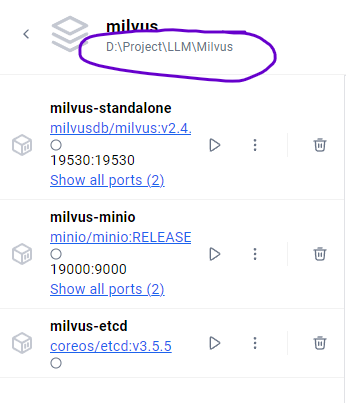

## Docker

### WSL

Docker Desktop（这个 exe 应用程序）使用 WSL2 创建一个名为 `docker-desktop` 的 Linux 虚拟机。这个虚拟机的系统文件和数据都存储在 `docker_data.vhdx` 这个虚拟硬盘文件中

即 Docker 的一切（包括容器镜像存储卷、引擎）被放在这里：

```
C:\Users\liuyanming\AppData\Local\Docker\wsl\disk\docker_data.vhdx
```

备注：wsl2 里是可以构造好几个虚拟机的，并且它们的 vhdx 应该可以自己指定位置，所以这里 先 docker 后 wsl，应该只是 Docker Desktop 的自己愿意这样写。（因为我想起安装 Docker 时，它建议是用 wsl，所以可能不一定要基于 wsl）

并且这个位置应该也是可以换掉的，我看在 GUI 界面的 Settings->Resources 里可以换

### 镜像位置及复用

镜像的位置众说纷，我也没找到

https://stackoverflow.com/questions/42250222/where-is-docker-image-location-in-windows-10

建议是，有需要导出的时候

```d
docker image save myimagename -o myimagename.zip
```

复用的处理比较复杂

Dockerfile 的每一条指令，代表产生了一个新的"层"，每一层有一个唯一 hash

如果你 pull 一个新的镜像，Docker 会检查这个镜像的清单文件，检查所有的层

即，如果你两个不同的镜像，第一条语句都是安装 ubuntu20.04 那确实会复用到

### 存储卷

Volumes 设计为持久存储可读写，但是镜像 Images 是只读的

卷的真正位置似乎在（Docker version 27.5.1, build 9f9e405）

```
\\wsl.localhost\docker-desktop\mnt\docker-desktop-disk\data\docker\volumes
```

这个位置，只有在 docker 启动后，才能看到。一旦 docker 结束，该位置会变成一个 json

当然你在 GUI 界面的 Volumes 里可以直接看到所有卷

生命周期：

1、卷 和 镜像 是独立的

2、一个卷可以被多个容器同时使用

### 绑定挂载

Docker 存储数据的两种主要“流派”：具名卷 (Named Volumes) 和 绑定挂载 (Bind Mounts)

n8n 是前者，Milvus 是后者

放在 yml 旁边的好处是所见即所得，迁移简单

追求性能用 Volumes

### Compose

（compose：组成）

很多项目，都是通过提供 docker-compose.yml 来配置多个容器（前后端分离），在 UI 里，就是 Containers 下一个可以展开的东西

你如果不知道你那个 Container 是从哪个 yml 来的，你可以点击它的名字，然后在这里看到



### 从命令行运行容器

```shell
docker compose up -d
docker compose -p "myproject" up -d
```

`docker compose up`：根据当前目录下的 `docker-compose.yml` 文件（或指定文件）启动所有定义的服务。

`d` 表示以“后台模式”（detached）运行容器，即容器启动后不会占用当前终端

`p` 项目准备叫什么，如果不给，似乎是 yml 所在的文件夹的名字

`f` yml 文件名

docker compose 和 docker-compose 是同一个效果

### 是死是活？

`docker run -it --rm --name n8n -p 5678:5678 -v n8n_data:/home/node/.n8n docker.n8n.io/n8nio/n8n`

这个 n8n 的命令，因为有 rm 所以结束后就似了

比如 dify 的命令，它是让你下载 yml，然后和`compose up -d`

我的疑惑：为什么删了 git 仓库，容器还在跑，下次重启电脑后，应该找不到 yml 了，按理说应该起不来了

AI：yml 是建筑图纸，而容器是根据图纸盖出来的大楼，楼盖好以后，删了图纸楼并不会塌（包括重启）

你最开始 `compose up -d`时，属于一个 yml 的容器会有同一个 Labels，所以 UI 上能给你放在一起

### yml

### 服务是什么

Docker Compose 和 Kubernetes 都以声明式的 YAML 文件来描述“我要运行哪些容器，以及它们之间如何协作”，但是 k8s 功能更多，并且可以跨机器

docker-compose.yml 里面可以配置多个容器，统一部署

**服务**是对容器的声明式管理与编排，而容器是服务运行时的具体实例

在 docker 里，写 dockerfile 就是写服务

服务是对容器组（或容器集群）的**声明式描述**：你在服务里告诉编排系统（Docker Swarm、Kubernetes、Compose 等）想要运行多少个副本（replicas）、用哪个镜像（image）、要挂载哪些网络或存储卷、采用怎样的更新策略（rolling update）

```yaml
version: '3.5' # 这个是 docker 的版本

services: # 要运行的服务
  etcd: # 第一个服务的名字
    restart: "no" # 开机自启
    container_name: milvus-etcd 
    image: quay.io/coreos/etcd:v3.5.5
    environment:
      - ETCD_AUTO_COMPACTION_MODE=revision
      - ETCD_AUTO_COMPACTION_RETENTION=1000
      - ETCD_QUOTA_BACKEND_BYTES=4294967296
      - ETCD_SNAPSHOT_COUNT=50000
    volumes:
      - ${DOCKER_VOLUME_DIRECTORY:-.}/volumes/etcd:/etcd
    command: etcd -advertise-client-urls=http://127.0.0.1:2379 -listen-client-urls http://0.0.0.0:2379 --data-dir /etcd
    healthcheck:
      test: ["CMD", "etcdctl", "endpoint", "health"]
      interval: 30s
      timeout: 20s
      retries: 3

  minio:
    restart: "no"
    container_name: milvus-minio
    image: minio/minio:RELEASE.2023-03-20T20-16-18Z
    environment:
      MINIO_ACCESS_KEY: minioadmin
      MINIO_SECRET_KEY: minioadmin
    ports:
      - "9001:9001"
      - "9000:9000"
    volumes:
      - ${DOCKER_VOLUME_DIRECTORY:-.}/volumes/minio:/minio_data
    command: minio server /minio_data --console-address ":9001"
    healthcheck:
      test: ["CMD", "curl", "-f", "http://localhost:9000/minio/health/live"]
      interval: 30s
      timeout: 20s
      retries: 3

  standalone:
    restart: "no"
    container_name: milvus-standalone
    image: milvusdb/milvus:v2.4.15
    command: ["milvus", "run", "standalone"]
    security_opt:
    - seccomp:unconfined
    environment:
      ETCD_ENDPOINTS: etcd:2379
      MINIO_ADDRESS: minio:9000
    volumes:
      - ${DOCKER_VOLUME_DIRECTORY:-.}/volumes/milvus:/var/lib/milvus
    healthcheck:
      test: ["CMD", "curl", "-f", "http://localhost:9091/healthz"]
      interval: 30s
      start_period: 90s
      timeout: 20s
      retries: 3
    ports:
      - "19530:19530"
      - "9091:9091"
    depends_on:
      - "etcd"
      - "minio"

networks:
  default:
    name: milvus
```