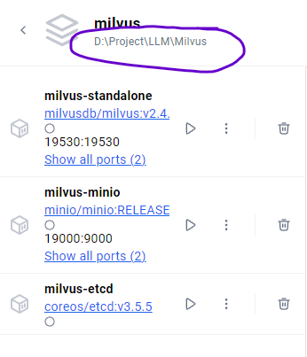

## Docker

### 解决的问题

环境一致性的打包和分发

不要把程序"单独"送过去，要把程序 + 它需要的一切（glibc、Python、依赖库、系统工具）打包成一个 标准容器，送到哪里都是一样地跑

### 实现（Linux）

Docker 依赖 Linux 内核能力，尤其是 namespace、cgroup、overlay filesystem、iptables/nftables

docker CLI
   ↓
dockerd / containerd
   ↓
Linux kernel
   ↓
namespace / cgroup / overlayfs / 网络栈
   ↓
容器进程

docker 是由一个有 root 权限的 dockerd 守护进程管理

docker-cli 处理命令行的命令，**dockerd** 调用容器运行时 **containerd**，它再通过 **runc** 与操作系统交互

人们认为 dockerd 有 root 很坏，不安全

容器不是传统虚拟机。它们共享宿主机 Linux 内核，只是被 namespace/cgroup 隔离起来。

### 实现（Windows）

Docker Desktop（这个 exe 应用程序）使用 WSL2 创建一个名为 `docker-desktop` 的 Linux 虚拟机。这个虚拟机的系统文件和数据都存储在 `docker_data.vhdx` 这个虚拟硬盘文件中

即 Docker 的一切（包括容器镜像存储卷、引擎）被放在这里（后续可能还会变，并且你也可以换）

它在 设置 -> 资源 -> 进阶 里可以看到，那个"Disk image location"：

`%AppData%\Local\Docker\wsl\disk\docker_data.vhdx`

备注：wsl2 里是可以构造好几个虚拟机的，不是只有 docker-desktop，你可以装自己的。（安装 Docker 时，它建议是用 wsl，所以可能不一定要基于 wsl）

（Windows 不只可以跑 Linux containers，也可以跑 Windows containers，不过一般都是前者）

### 实现（Mac）

也是跑一个内置的虚拟机，在 Mac 上，此虚拟机可选（在设置里可换），默认是 Apple Virtualization Framework。

Docker VMM 是一个 Beta 选择，但是它的提示是性能更优

并默认开启 Rosetta 来转译 x64 程序

磁盘在 `~/Library/Containers/com.docker.docker/Data/vms/0/data/Docker.raw`

### 确保启动

命令行使用 docker，你需要本机先启动 docker，别在没启动 docker 时使用，而不知道哪里错了

检查：`docker version` 必须显示 Server，而不只是 Client

### 镜像与容器

镜像类似于可执行文件本身

容器类似于跑起来的进程

所以和普通程序一样，数据并不能放在镜像里，而是放在镜像外面

重点：容器由镜像（只读层） + 容器层（读写层）组成

容器运行时，所有写入（修改、创建、删除）都会进入该容器的特定可写层

只要容器不被删除，可写层一直保存在你的磁盘上，这也是容器默认被留着的原因（即 start restart 后都在）

### 镜像位置及复用

镜像的位置众说纷，我也没找到

https://stackoverflow.com/questions/42250222/where-is-docker-image-location-in-windows-10

建议是，有需要导出的时候

```shell
docker image save myimagename -o myimagename.zip
```

镜像复用的处理比较复杂

Dockerfile 的每一条指令，代表产生了一个新的"层"，每一层有一个唯一 hash

如果你 pull 一个新的镜像，Docker 会检查这个镜像的清单文件，检查所有的层

即，如果你两个不同的镜像，第一条语句都是安装 ubuntu20.04 那确实会复用到

### 外部仓库

Docker Hub 是默认的源，里面存储着 Docker 镜像（无论是否登陆，都限速），镜像名字不需要声明 url，直接写

GHCR 是 GitHub 版的镜像仓库，镜像名字必须是 `ghcr.io/owner/repo:tag`

GITHUB_TOKEN 自带写权限

### 存储卷

“被系统抽象出来、可以挂载使用的存储区域”，被 Docker 管理的一个持久化目录

Volumes 设计为持久存储可读写，但是镜像 Images 是只读的，Volumes 让数据独立于容器生命周期

在 Linux 上，卷默认被放在 `/var/lib/docker/volumes/mysql-data/_data`

Windowsw 上，在 `\\wsl.localhost\docker-desktop\mnt\docker-desktop-disk\data\docker\volumes` （Docker version 27.5.1, build 9f9e405）；这个位置，只有在 docker 启动后，才能看到。一旦 docker 结束，该位置会变成一个 json

当然你在 GUI 界面的 Volumes 里可以直接看到所有卷

对于 Linux，就是直接占你的本机磁盘的空间；对于 win/mac 则是占你虚拟机内部的空间，最后体现在 vhdx 里

生命周期：

1、卷 和 镜像 是独立的

2、一个卷可以被多个容器同时使用

命令：

```shell
docker volume create mysql-data
docker run -v mysql-data:/var/lib/mysql mysql
```

### 绑定挂载

**Docker 存储数据的两种主要“流派”：具名卷 (Named Volumes) 和 绑定挂载 (Bind Mounts)**

即直接拿本记目录去挂载（都是挂载目录，一个在本机，你可以自己看见，修改；一个被 Docker 管理）

n8n 是前者，Milvus 是后者

放在 yml 旁边的好处是所见即所得，迁移简单

追求性能用 Volumes

命令：

```shell
docker run -v ~/project:/app node
```
### 网络

在 Mac/Windows 上，Docker 在一个虚拟机里，虚拟机的网络是 NAT 模式

在 Linux 上，Docker 会创建自己的虚拟网卡，容器内依然有自己的网络命名空间

应用程序（容器）监听的端口一直是容器内部的

所以需要端口映射 -p (ports)

expose 只声明容器内部服务端口，主要给同一个 Docker 网络里的其他容器看

### Dockerfile

描述如何制作一个容镜像所需的步骤

大致包含：OS、Python、各种包等等 

你自己去 build，默认和其他网上下载的镜像放在同一个位置，并不会出现在你的当前目录

### Compose

（compose：组成）

很多项目，都是通过提供 docker-compose.yml 来配置多个容器（前后端分离），在 UI 里，就是 Containers 下一个可以展开的东西

你如果不知道你那个 Container 是从哪个 yml 来的，你可以点击它的名字，然后在这里看到



有一些 docker-compose.yml 只依赖远程镜像，这种你可以把它拿走，在任何位置跑起来

还有一些依赖于当前目录，比如 `duild .`，或者依赖 env 文件之类的

### 从命令行运行容器

```shell
docker compose up -d
docker compose -p "myproject" up -d
```

`docker compose up`：根据当前目录下的 `docker-compose.yml` 文件（或指定文件）启动所有定义的服务。

`d` 表示以“后台模式”（detached）运行容器，即容器启动后不会占用当前终端

`p` 项目准备叫什么，如果不给，似乎是 yml 所在的文件夹的名字

`f` yml 文件名

docker compose 和 docker-compose 是同一个效果

### 是死是活？

`docker run -it --rm --name n8n -p 5678:5678 -v n8n_data:/home/node/.n8n docker.n8n.io/n8nio/n8n`

这个 n8n 的命令，因为有 rm 所以结束后就似了

比如 dify 的命令，它是让你下载 yml，然后和`compose up -d`

Q：为什么删了 git 仓库，容器还在跑，下次重启电脑后，应该找不到 yml 了，按理说应该起不来了

A：yml 是建筑图纸，而容器是根据图纸盖出来的大楼，楼盖好以后，删了图纸楼并不会塌（包括重启）

你最开始 `compose up -d`时，属于一个 yml 的容器会有同一个 Labels，所以 UI 上能给你放在一起

### 服务是什么

Docker Compose 和 Kubernetes 都以声明式的 YAML 文件来描述“我要运行哪些容器，以及它们之间如何协作”，但是 k8s 功能更多，并且可以跨机器

docker-compose.yml 里面可以配置多个容器，统一部署

**服务**是对容器的声明式管理与编排，而容器是服务运行时的具体实例

在 docker 里，写 dockerfile 就是写服务

服务是对容器组（或容器集群）的**声明式描述**：你在服务里告诉编排系统（Docker Swarm、Kubernetes、Compose 等）想要运行多少个副本（replicas）、用哪个镜像（image）、要挂载哪些网络或存储卷、采用怎样的更新策略（rolling update）

### 常用命令

镜像：

docker image ls

docker pull = docker image pull

docker push = docker image push

容器：

docker container ls

docker ps = docker container ps

这俩一回事

启动：

docker run

参数极多，很多时候不得不写成启动脚本来启动，否则记不住

-d 后台运行

-it 交互式运行（一旦出去，容器也结束了）

--name 一般要起名，否则 ID 是系统给的随机字符

--rm 退出后，自动删除

-p 端口映射 -p 8080:80 前面的是主机，后面是容器

-it 和 --rm 很多时候一起用，并不重复

你需要搞清楚三件事情

（1）容器的主进程结束

（2）容器停止

（3）容器本身被删掉

-it 是当你 exit 时，主进程 bash 退出，所以容器也停止了，但是没被删掉（即 docker ps 还能看到）

--rm 才是删掉

docker start

run 是创建一个新的容器，start 是启动一个存在的但是停止的

执行命令（已经启动了）：

docker exec -it {id/名字} /bin/bash

日志：

docker logs -f container

实际上在用开源项目 or 公司内，应该是大部分的命令都是

docker compose，因为很多时候不止跑一个容器