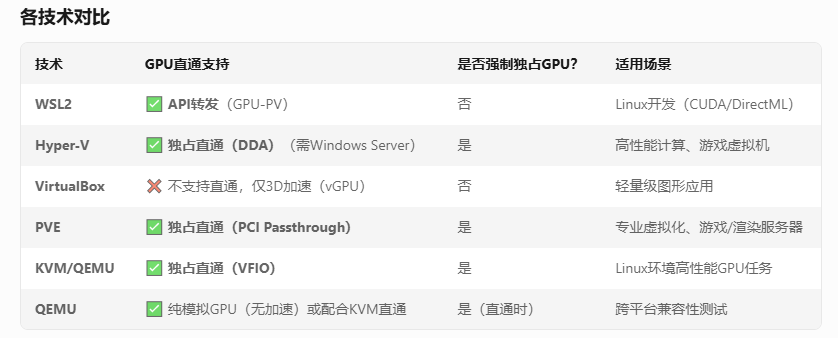
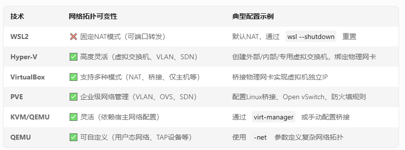
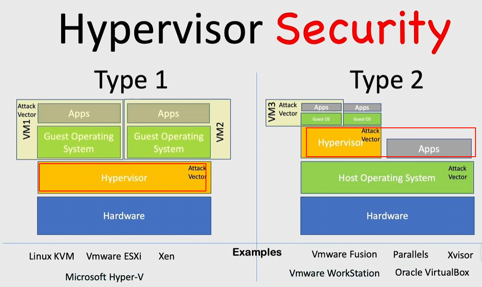
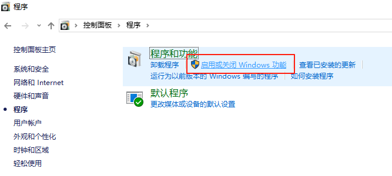

# 虚拟化平台

主要关注几点

### GPU 是否可以直通，是哪种直通

- **独占式直通（PCIe Passthrough）**：将物理 GPU 完全分配给虚拟机，宿主机无法使用该 GPU。（补充：即 GPU 属于某一个虚拟机，其它人用不了）
- **半虚拟化（Paravirtualization）**：通过虚拟化驱动（如 virtio-gpu）共享 GPU 资源，无需独占。
- **API 转发（API Forwarding）**：将 GPU 计算 API（如 CUDA）转发给虚拟机，例如 WSL2 的 GPU-PV 模式。


据说 Hyper-V 也能实现共享 GPU，但是需要用一些偏门脚本

### 和主机之间网络拓扑是否可变

基本上除了 WSL2 是写死的，其它都可以随意调整



### 第一类和第二类虚拟化

Hypervisor 虚拟机监视器，用于创建和管理虚拟机

Type-1 是 Hyper-V、ESXI、KVM。所有的操作系统都要虚拟化，包括当前的操作系统。Hyper-V 一般损失 1%，最大 5%。

Vistual Box、WMWare 是 Type-2





### 第一、二类虚拟化同时使用？

以前好像确实是不可以的，即安装了 Docker，因为会依赖 WSL2，所以打开了 Hyper-V，导致 VMWare 不能用了

但现在好像可以了，即 VMWare 不需要直接请求占据 CPU 的虚拟化接口，而是微软又搞了个兼容层接口，转调 Hyper-V

即 Docker 和 VMWare 可共存

基本上你最多套两层，虚拟机 Linux 里再装 Docker 也不是虚拟化了

做 GPU 计算，基本上就是 DockerDesktop(WSL2)

### Docker

Docker Desktop 默认会创建一个名为 docker-desktop 的 WSL 发行版，用于运行 Docker 守护进程和容器。这时候，即使启动多个容器，它们其实都是在同一个 Linux 内核下运行的，通过 Docker 的守护进程管理，而不是每个容器单独一个 WSL 实例。因此，所有容器共享同一个 Linux 内核，但彼此隔离，就像在普通的 Linux Docker 环境中一样

### 常见工具

1、WSL2

开启 WSL2 的前置条件是开启 Hyper-V

WSL1 是 微软把 linux 的命令翻译为了 windows 命令，因此没有真正的 Linux 内核，而且维护起来比较麻烦，所以放弃了

WSL2 是基于 Hyper-V，在这上面运行一个 真正的 Linux

```shell
C:\Users\liuyanming>wsl --list -v
  NAME              STATE           VERSION
* docker-desktop    Running         2
```

这里带 `*` 的是默认的

请注意 WSL2 里不是只能安装 Docker，也可以安装别的 Linux

2、Hyper-V

家庭版无法使用

GPU 默认是不共享的，所以虚拟机实际上没有 GPU，只有核显，能跑 OpenGL 的程序

两个 Windows 之间，不支持拖拽复制文件，但是支持 右键/Ctrl-CV 复制粘贴

网络拓扑更改请看网络拓扑那篇文章

3、VMware WorkStation 

4、Virtual Box

5、PVE Proxmox Virtual Environment

6、Exsi

7、KVM Kernel Based Virtual Machine

8、qemu

9、Docker