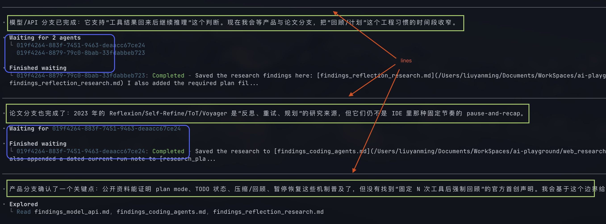

### 时间线

2022 年 1 月份，Chain-of-Thought Prompting 被正式提出，这是大模型第一次输出“推理链条”

2022 年 5 月份，Let’s think step by step 提示词被发明，用以降低 CoT 的使用门槛

2022 年 10 月份，一个叫做 ReAct 的范式被提出，思考、调用工具/环境、观察结果、继续思考。为后续 Agent 产品铺路。

2022 年 11 月，ChatGPT

2023 年 3 月，一个叫做 AutoGPT 的开源项目，它提出“循环工作”的概念

2023 年 6 月，OpenAI 发明 Function Call

在这个阶段，基本上只有 OpenAI 能“干活”，而非纯对话，当时还有个深度调研，因为 OpenAI 整合了所有的流程

2024 年下半年~ 2025 年上半年，Cursor 等产品才逐步出现，当时基本上在 IDE 侧边栏干活

2025 年年中的时候，Claude Code 等产品基本就推出了

### 已知事实

（1）当时 Cursor、Trae、Qwen CLI 无法持久的干活，而且总是陷入到一直读取日志到死循环里

（2）闭源模型关闭对外的思维链的可见性

（3）现在 Codex、CC 里的 GUI 设计是，你提出需求，它在不断的干活，干活的过程中，它会**总结当前进度和下一个小步骤**，以及调用工具，节奏大概是，先总结一下，然后调用 3 个工具，重复，最后给出一个端到端的总结。尤其是 Codex。

如图：

### Agent 循环检查点机制

当时死循环，就是因为模型一个又一个的连读调用 read 工具，也不回复你进度，就是使劲看

而且 Claude Code 挣脱了这个循环，很大程度是靠总结进度来“清醒”的

Agent 循环检查点机制：一种运行时与提示词共同形成的交互模式，Agent 在若干次工具调用之间周期性暂停，输出用户可见的进展更新，回顾当前状态，说明下一小步目标，然后继续执行。

我目前调查到如下设计：

（1）A\ 是最开始设计这套理念的公司，其认为，在连续的工具调用之间，插入用户可见的状态解释，有助于完成任务以及，它还提出了“交错思考”的概念

（2）OpenCode 的 AgentLoop 对工具使用最大次数，和连续使用次数都有限制，尤其是后者，连续调用后，会强制模型停下来思考现状

（3）OpenCode 针对不同的模型做了不同的提示词，尤其是针对 gpt 的提示词很值得品味，它没有在运行层面，强迫模型“你使用三次工具后，必须停下来回顾进展和规划下一小步”；而是在提示词里建议模型这样做

我这里直接贴出汉化后的提示词供参考（当然，它不是唯一的设计，CC 很喜欢在这里回复你好问题，但是在 OpenCode 里被禁止）

```txt
### `commentary` 通道

只将 `commentary` 用于中间更新。这些是你工作时的小更新，它们不是最终答案。保持更新简短，以在你工作时向用户传达进展和新信息。

当更新添加有意义的新信息时发送更新：一个发现、一个权衡、一个阻碍、一个实质性计划，或一个非平凡编辑或验证步骤的开始。

不要叙述常规的读取、搜索、明显的下一步或次要确认。将相关的进展合并为单个更新。

不要以对话式的感叹词或元评论开始回复。避免开头如确认语（"完成——"、"明白了"、"好问题"）或框架性短语。

在实质性工作之前，发送描述你第一步的简短更新。在编辑文件之前，发送描述编辑的更新。

在你获得足够的上下文，且工作是实质性的时候，你可以提供更长的计划（这是唯一可以超过 2 句话并可以包含格式的用户更新）。

### `final` 通道

对完成的回复使用 final。

如有必要，结构化你的最终回复。答案的复杂度应匹配任务。如果任务很简单，你的答案应该是一句话。按从一般到具体到支持的顺序排列部分。

如果用户要求代码解释，包含代码引用。对于简单任务，只陈述结果而不使用繁重格式。

对于大或复杂的更改，以解决方案引导，然后解释你做了什么以及为什么。对于随意的聊天，就随意聊天。如果某件事无法完成（测试、构建等），说明。只有在自然且有用时才建议下一步；如果你列选项，使用编号项目。
```

（4）模型仍然只有一次机会，从思考模式，转换回到普通模式。所以闭源模型仍可以保持推理链的隐藏，因为每一次 commentary 通道发生，都是已经退出了思考模式，commentary 的内容是用户可见的

（5）在 GUI 设计上，模型会输出很多次用户可见的 commentary 内容，然而这些内容可折叠，只有最后的 final 才是端到端完成的结果。这与网页版 DeepSeek 的设计类似，却又不同，因为网页版，被折叠的内容是 DeepSeek 的思维链，而 Agent 产品里其实是某次最终回复。

（6）根据前一点，工具的调用、总结，并不是思维链里面的 token，所以一个模型不思考，也一样能干活，只是效率差罢了