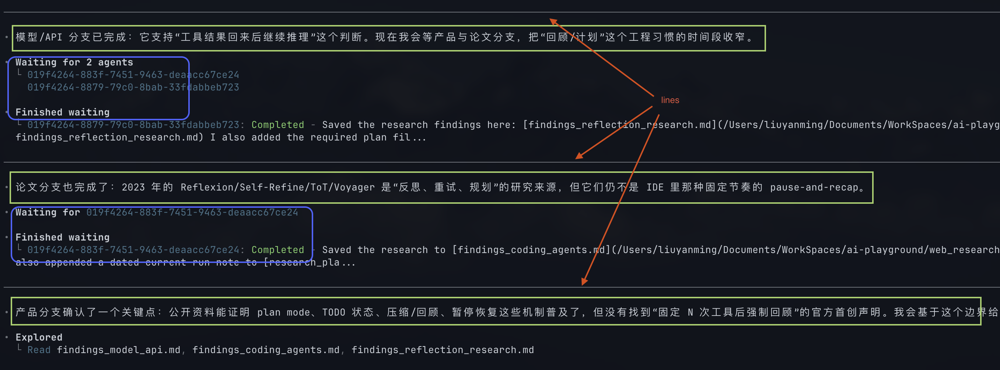

### 时间线

2022 年 1 月份，Chain-of-Thought Prompting 被正式提出，这是大模型第一次输出"推理链条"

2022 年 5 月份，Let's think step by step 提示词被发明，用以降低 CoT 的使用门槛

2022 年 10 月份，一个叫做 ReAct 的范式被提出，思考、调用工具/环境、观察结果、继续思考，为后续 Agent 产品铺路

2022 年 11 月，ChatGPT

2023 年 3 月，一个叫做 AutoGPT 的开源项目，它提出"循环工作"的概念

2023 年 6 月，OpenAI 发明 Function Call

在这个阶段，基本上只有 OpenAI 能"干活"，而非纯对话，当时还有个“深度调研”功能，因为 OpenAI 整合了所有的流程

2024 年下半年~ 2025 年上半年，Cursor 等产品逐步出现，当时基本上在 IDE 侧边栏干活

2025 年中，Claude Code 等产品基本就推出了

### 已知事实

（1）当时 Cursor、Trae、Qwen CLI 无法持久的干活，而且总是陷入到一直读取日志到死循环里

（2）闭源模型关闭对外的思维链的可见性

（3）现在 Codex、CC 里的 GUI 设计是，你提出需求，它在不断的干活，干活的过程中，它会**总结当前进度和下一个小步骤**，以及调用工具，节奏大概是，先总结一下，然后调用 3 个工具，重复，最后给出一个端到端的总结。尤其是 Codex。

如图：

这种"边干活边汇报"的交互模式，感觉是没有一个具体的名字，我这里把它叫做：**Commentary（评论通道）**。

### 评论的实现

评论的实现，暗藏着“交错式思维”的产生与推广

我们要从 API 层面，一步步挖掘它是如何被设计出来的

#### Chat Completions API

在 Chat Completions API 中，**一次 API 调用返回一个 message 对象**。文本（`content`）和工具调用（`tool_calls`）是这同一个对象的两个字段：

```
API 调用 ①:
  输入: messages = [系统提示词, 用户: "帮我写周报"]
  输出: {
    "role": "assistant",
    "content": "我先看看项目里的文件，然后整理成周报。",  ← 这就是 "commentary"
    "tool_calls": [
      {"function": {"name": "read_file", ...}},
      {"function": {"name": "glob", ...}}
    ],
    "finish_reason": "tool_calls"  ← "我还没完"
  }

→ Harness 执行 read_file、glob，把结果拼回 messages

API 调用 ②:
  输入: messages = [..., 上面的assistant消息, tool结果们]
  输出: {
    "role": "assistant",
    "content": "数据拿到了，现在生成周报。",
    "tool_calls": [{"function": {"name": "write_file", ...}}],
    "finish_reason": "tool_calls"
  }

→ Harness 执行 write_file

API 调用 ③:
  输入: messages = [..., tool结果]
  输出: {
    "role": "assistant",
    "content": "周报写好了，放在 docs/weekly.md。",  ← 这就是 "final"
    "finish_reason": "stop"  ← "我完了"
  }
```

关键：

1. **评论和紧随其后的至少一个工具调用是同一个 API 请求。** 你看到的"AI 先说一段话 → 然后调几个工具"发生在一次 LLM 生成中——文本和工具调用是同一个 message 的 `content` 和 `tool_calls` 两个字段，不是两次 API 调用。

2. **没有真正的"通道"切换。** 在 API 层面，评论和最终回复，都是 `content` 字段里的纯文本，API 本身不区分，反而靠 `finish_reason` 来区分

3. **循环由 `finish_reason` 驱动** 模型通过 `finish_reason: "tool_calls"` 告诉 harness "我还要继续"，harness 就执行工具、拼回结果、再调一次 API。`finish_reason: "stop"` 表示"干活结束"。Harness 不需要判断哪段文本是 commentary、哪段是 final——它只检查有没有 tool_calls 需要执行。在 UI 层面，把前面的 content 渲染到中间可折叠，最后一次 content 输出给你。

#### 为什么所有 Agent 工具都能做到输出评论

Kimi-Code、OpenCode 全部用可以用 Chat Completions API。效果来自于三层叠加：

| 层次 | 作用 | 性质 |
|------|------|------|
| **模型后训练** | 现代 LLM 被教会了"调用工具前/后输出文字说明"。这是模型权重里的能力。 | 硬基础 |
| **系统提示词** | 告诉模型**什么时候**该说话、**说什么**（简短、具体、面向进展、不要叙述常规操作）。 | 软约束 |
| **Harness 循环** | 执行工具 → 喂回结果 → 继续请求。`finish_reason: "tool_calls"` → 继续循环，`"stop"` → 结束 Turn。 | 硬结构 |

#### Responses API

OpenAI 率先定义了 Chat Completions API（2025 年 3 月），但是反而自己最先舍弃了它

Responses API 的关键概念叫做 Turn

一个 Turn = 从用户提问到模型给出最终回答的完整过程

一个 Turn 可以包含多次 API 调用

```
用户: "帮我写周报"                    ← 输入
  │
  ▼
┌──────────────────────────────────────────────────────┐
│                    ONE TURN                          │
│                                                      │
│  API Call ① ─ 一次 LLM 请求                           │
│  ├─ content: "我先看看这周的文件..."     ← commentary   │
│  └─ tool_calls: [read_file, glob]                    │
│         │                                            │
│         ▼ (harness 执行工具，结果拼回 messages)         │
│  API Call ② ─ 再一次 LLM 请求                         │
│  ├─ content: "数据拿到了，开始写周报"    ← commentary    │
│  └─ tool_calls: [write_file]                         │
│         │                                            │
│         ▼ (harness 执行工具)                          │
│  API Call ③ ─ 再一次 LLM 请求                         │
│  └─ content: "周报写好了！放在 docs/weekly.md"          │
│       finish_reason: "stop"  → Turn 结束              │
└──────────────────────────────────────────────────────┘
```

看起来差不多？是的，其实差距不是特别大

关键在于 Responses API 真正的引入了评论通道，以前 Chat Completions，无论是评论，还是最终回复，都放在 content 里，而 Responses 是独立的

#### Chat Completions API vs Responses API

| | Chat Completions | Responses API |
|---|---|---|
| **一次请求的输出** | 一个 message 对象（content + tool_calls 混在一起） | 多个独立 item 的序列，每个有 type 和 phase |
| **能否区分 commentary/final** | 不能（都是 content 字段里的文本） | 能（`phase: "commentary"` vs `phase: "final_answer"`） |
| **单次请求中文本和工具能否交错** | 不能（只能一次文本 + 一次工具调用列表） | 能（说一句 → 调工具 → 再说一句 → 再调工具，全在一次 response 中） |
| **服务端状态** | 无状态（客户端管理全部历史） | 有状态（`previous_response_id`，reasoning state 跨 turn 保留） |

Codex 用 Responses API 主要是为了服务端状态管理（reasoning state 保留、更好的缓存命中率 +40-80%），不是为了 commentary（我们后续在交错式思维里详细说）。只要评论的话 Chat Completions 完全够用。

### Agent 循环检查点机制（不会死循环）

当时死循环，就是因为模型一个又一个的连读调用 read 工具，也不回复你进度，就是使劲看。Claude Code 挣脱了这个循环，很大程度是靠总结进度来"清醒"的。

Agent 循环检查点机制：一种运行时与提示词共同形成的交互模式——Agent 在若干次工具调用之间周期性暂停，输出用户可见的进展更新，回顾当前状态，说明下一小步目标，然后继续执行。

我目前调查到如下设计：

（1）Anthropic 是最开始设计这套理念的公司，其认为，在连续的工具调用之间，插入用户可见的状态解释，有助于完成任务。

（2）OpenCode 的 AgentLoop 对工具使用最大次数和连续使用次数都有限制，尤其是后者——连续调用后，会强制模型停下来思考现状

（3）OpenCode 针对不同的模型做了不同的提示词，尤其是针对 GPT 的提示词很值得品味。它没有在运行层面强迫模型"你使用三次工具后，必须停下来回顾进展和规划下一小步"，而是在提示词里建议模型这样做。

OpenCode 汉化后的提示词供参考（当然，它不是唯一的设计——CC 很喜欢在这里回复"你好"、"好问题"，但在 OpenCode 里被禁止）：

```txt
### `commentary` 通道

只将 `commentary` 用于中间更新。这些是你工作时的小更新，它们不是最终答案。保持更新简短，以在你工作时向用户传达进展和新信息。

当更新添加有意义的新信息时发送更新：一个发现、一个权衡、一个阻碍、一个实质性计划，或一个非平凡编辑或验证步骤的开始。

不要叙述常规的读取、搜索、明显的下一步或次要确认。将相关的进展合并为单个更新。

不要以对话式的感叹词或元评论开始回复。避免开头如确认语（"完成——"、"明白了"、"好问题"）或框架性短语。

在实质性工作之前，发送描述你第一步的简短更新。在编辑文件之前，发送描述编辑的更新。

在你获得足够的上下文，且工作是实质性的时候，你可以提供更长的计划（这是唯一可以超过 2 句话并可以包含格式的用户更新）。

### `final` 通道

对完成的回复使用 final。

如有必要，结构化你的最终回复。答案的复杂度应匹配任务。如果任务很简单，你的答案应该是一句话。按从一般到具体到支持的顺序排列部分。

如果用户要求代码解释，包含代码引用。对于简单任务，只陈述结果而不使用繁重格式。

对于大或复杂的更改，以解决方案引导，然后解释你做了什么以及为什么。对于随意的聊天，就随意聊天。如果某件事无法完成（测试、构建等），说明。只有在自然且有用时才建议下一步；如果你列选项，使用编号项目。
```

（4）对于推理模型（如 GPT-5、o3 等），每次 API 响应中，推理（reasoning tokens）先生成，然后才生成用户可见的文本（包括 commentary 和 final）。闭源模型正是通过这种方式保持推理链的隐藏——reasoning tokens 永远不暴露给用户，只有 reasoning 的摘要可选可见。这不是一个"模式切换"，而是同一生成过程中的先后顺序：先推理、后输出文本、再可能调用工具

（5）在 GUI 设计上，模型会输出很多次用户可见的 commentary 内容，然而这些内容可折叠，只有最后的 final 才是端到端完成的结果。这与网页版 DeepSeek 的设计类似，却又不同——网页版被折叠的内容是 DeepSeek 的思维链，而 Agent 产品里被折叠的是中间过程的进度更新，最后展示的是最终回复

（6）根据前一点，工具的调用、总结并不是思维链里面的 token，所以一个模型不思考也一样能干活，只是效率差罢了

（7）Codex 也依靠提示词设计，在 models.json 同样提到了那两个通道。但 Codex 额外使用了 OpenAI Responses API，其输出中的每个 message item 有 `phase` 字段（`"commentary"` / `"final_answer"`），这是 API 层面的结构性标注，不是提示词概念。不过这不是 commentary 效果的必要条件——Chat Completions API 下同样能做到（见上文"Chat Completions API vs Responses API"对比）

下面是 Codex 的提示词原文：

你有两个与用户保持对话的渠道：你在 `commentary` 频道分享更新。你通过向 `final` 频道发送最终消息来交回给用户并结束你的回合

中间评论：在工作时，你向 `commentary` 频道发送消息。这些消息是你在工作时与用户协作的方式——陈述假设和提供更新。

这些消息应简洁且易于快速浏览。这些消息的目标是让你的工作易于用户理解和验证。

如果用户的请求需要调用工具，从 `commentary` 频道的消息开始。

用户欣赏你在回合中持续、频繁的沟通，在工作进行中不应超过 60 秒没有评论更新。

不要在 commentary 频道中放置应该在 final 频道中提出的最终回复（例如阻塞性的/澄清性问题）。

commentary 频道中给用户的消息仅是部分更新、部分结果或非阻塞性问题，可以在 AI 助手继续工作时为用户提供价值。

最终答案必须始终完全自包含：用户永远不需要阅读早期的评论更新，因为在向用户显示最终答案后，它们会被折叠。

```txt
在发出工具调用之前，向用户发送一条简短的前言，说明你即将做什么。在发送前言消息时，遵循以下原则和示例：

- **逻辑分组相关操作**：如果你即将运行几个相关命令，在一个前言中一起描述，而不是为每个命令单独发送一条消息。
- **保持简洁**：不超过 1-2 句话，聚焦于当下的具体步骤。（快速更新用 8-12 个词）。
- **基于先前上下文**：如果这不是你的第一次工具调用，使用前言消息将之前的操作串联起来，给用户营造一种进展感和清晰感，让他们理解你的下一步行动。
- **保持语气轻松、友好且好奇**：在前言中添加一点个性，使其感觉协作且引人入胜。
- **例外**：避免为每个琐碎的读取操作（如 `cat` 单个文件）添加前言，除非它是更大的分组操作的一部分。

**示例：**

- "我已经探索了仓库；现在检查 API 路由定义。"
- "接下来，我将修补配置并更新相关测试。"
- "我即将搭建 CLI 命令和辅助函数。"
- "好的，我已经理解了仓库的结构。现在深入 API 路由。"
- "配置看起来不错。接下来是修补辅助函数以保持同步。"
- "完成了对 DB 网关的探查。接下来我将追踪错误处理。"
- "好的，构建管道的顺序很有意思。检查它如何报告失败。"
- "发现了一个巧妙的缓存工具；现在查找它的使用位置。"

对于你处理的特别长任务（即需要多次工具调用，或包含多个步骤的计划），你应该在合理的间隔内向用户提供进度更新。这些更新应结构化为简洁的一两句（不超过 8-10 个词），用平实的语言回顾到目前为止的进展：这个更新展示了你对需要完成的任务的理解、到目前为止的进展（即探索过的文件、完成的子任务），以及你下一步要去哪里。

在做可能给用户带来延迟的大块工作（即编写新文件）之前，你应该向用户发送一条简洁的消息，说明你即将做什么，以确保他们知道你在做什么上花时间。在通知用户你在做什么以及为什么之前，不要开始编辑或编写大文件。

你在工具调用之前发送的消息应以非常简洁的语言描述接下来即将做什么。如果之前有做过工作，这条前言消息还应包括到目前为止所做的工作的说明，以便让用户了解情况。
```

### 交错式思考（Interleaved Thinking）

Anthropic 提出的"交错思考"概念，和 commentary 常被混淆，但它们是两个层面的东西：

- **Commentary**：模型的**嘴**——"我先看看项目里的文件"，说给用户听的，用户可见
- **交错思考**：模型的**脑子**——推理链条跨 API 调用保留，用户不可见

#### 没有交错思考 vs 有交错思考

```
❌ 没有交错思考（传统 Extended Thinking）：

API Call ①: [推理：需要扫描项目文件，确定结构...] → tool: read_file
API Call ②: [推理：用户要写周报，我看到了 file1, file2...
            等一下，我刚才想到哪里了来着...重新梳理...]
            → tool: write_file

关键问题：每次 API 调用的推理是独立的。模型在 Call ① 的推理笔记，
         Call ② 看不到——因为 API 不保存 thinking block，只保存
         文字输出和工具调用结果。模型每轮都要"从零想起"。


✅ 有交错思考（Interleaved Thinking）：

API Call ①: [THINK block #1 + signature] → tool: read_file
                                ↓ 签名被保留并传回
API Call ②: [THINK block #2: 接上回，file1 里 A、B、C 说明
            周报结构应该是 X → Y → Z...] → tool: write_file

关键区别：thinking block 被签名（signature），由客户端原样传回给
         下一轮 API。模型不是"从零想起"，而是"续写上文"。
```

核心机制不是 API 格式的变化，而是**推理状态有没有被保存并传回**。

#### 各提供商的协议差异

"Chat Completions" 这个词既指 OpenAI 定义的一个具体 JSON Schema（`POST /v1/chat/completions`），也常被泛用来指代所有 LLM 提供商的文本生成 API。实际各家用的根本不是同一个东西：

| | OpenAI | Anthropic | DeepSeek | Gemini |
|---|---|---|---|---|
| **端点** | `/v1/chat/completions` | `/v1/messages` | `/v1/chat/completions` | `/v1/chat/completions` |
| **Schema** | Chat Completions 标准 | Messages（完全不同） | Chat Completions + 非标准扩展字段 | Chat Completions 兼容层 |
| **思考内容暴露？** | ❌ 不暴露 | ✅ thinking block + signature | ✅ `reasoning_content`（自创字段） | ✅ thought signatures |

标准 Chat Completions Schema 里没有、也从来没有过思考字段。能拿到思考内容的：
- **Anthropic**：根本不是 Chat Completions，是另一套 Messages API
- **DeepSeek**：在 Chat Completions 的 streaming delta 里塞了一个非标准的 `reasoning_content` 字段
- **OpenAI 自己的 Chat Completions**：思考在服务端生成后直接丢弃，是**唯一一个**既不暴露内容也不给签名的

Agent 工具（OpenCode 等）通过 AI SDK 屏蔽了这些差异——SDK 把 Anthropic 的 `thinking` 块、DeepSeek 的 `reasoning_content`、Gemini 的 thought signature 都归一化成 `reasoning` 事件。所以对上层代码来说"看起来都有思考"，但底层——OpenAI 的 Chat Completions 是真的没有。

三者在协议层面的对比：

```
                Chat Completions     Anthropic Messages    OpenAI Responses
                ────────────────     ─────────────────     ────────────────

思考内容对       ❌ 不传输             ✅ 明文 thinking        ⚠️ 摘要（普通用户）
客户端可见吗？                        block + signature      🔐 加密（ZDR 组织）

防篡改？         （没东西可改）        ✅ signature 验签       🔐 encrypted_content
                                                            服务端解密后使用

跨轮保留？       ❌ 协议无此概念       ✅ 客户端原样传回       ✅ previous_response_id
                                                            服务端自动保留

设计哲学         "我只是聊天 API"     "你自己保管思考链"     "我帮你保管思考链"
```

#### 各家实现

| 厂商 | 叫什么 | 机制 | 当前状态 |
|------|--------|------|---------|
| **Anthropic** | Interleaved Thinking | thinking block + signature，客户端传回 | Claude 4.6+ 自适应思考**自动开启**，不再需要手动 beta header |
| **OpenAI** | Reasoning State Preservation | Responses API 的 `previous_response_id`，reasoning items 服务端保存 | GPT-5+ 在 Responses API 下原生支持；Chat Completions 不支持 |
| **Google Gemini** | Thought Signatures | 与 Anthropic 类似，thinking block 必须传回 | **Gemini 3 强制要求**——tool calling 历史缺签名直接报错 |
| **DeepSeek** | Thinking in Tool-Use | 类似机制 | 支持 |
| **MiniMax M2** | Interleaved Thinking | 类似机制 | 支持 |

#### 思考丢弃的实际代价

对于思考内容不被保留的场景（OpenAI Chat Completions，或其他不暴露思考的提供商），模型每轮的推理在服务端生成后直接丢弃。对话历史里只保留 text 和 tool_calls，不保留推理过程。

**这意味着模型不是从"上一轮的推理断点"继续，而是从"上一轮的文字结论"重新推导：**

```
一个 10 轮工具调用的任务，每轮推理 300 token：

Chat Completions（思考丢弃）：
Round 1:  [策略推导 300tk] → 文字 → 工具     ← 从头想
Round 2:  [策略推导 300tk] → 文字 → 工具     ← 重新推导，大部分是与 Round 1 重复的内容
Round 3:  [策略推导 300tk] → 文字 → 工具
...
总推理 token：3000，其中约 2000 是重复推导

Interleaved Thinking（思考保留）：
Round 1:  [THINK#1: 建立策略 300tk] → 文字 → 工具
Round 2:  [THINK#2: 增量调整 100tk] → 文字 → 工具   ← 接上文，只需增量
Round 3:  [THINK#3: 增量推进 100tk] → 文字 → 工具
...
总推理 token：1200，几乎全是有效增量
```

缓存方面同理：在 Chat Completions 下，推理 token 是输出，不在输入缓存范围内。即使输入前缀命中缓存、省了输入 token 的钱，模型在输出侧仍然每轮生成大量重复推理。OpenAI 在切换到 Responses API 后缓存利用率从 40% 提升到 80%，不是因为 Responses API 有魔法，是因为 Chat Completions 下每轮的重复推理既浪费了钱，也没法缓存。

对实际使用的影响：

| | 短任务（≤3 轮工具） | 中任务（5-10 轮） | 长任务（20+ 轮） |
|---|---|---|---|
| **Chat Completions** | 基本没区别 | 推理 token 约 40-60% 是重复劳动 | 成本线性增长，模型容易跑偏 |
| **Interleaved Thinking** | 基本没区别 | 几乎全是增量 | 推理链不断，稳定线性 |

**简单说：Chat Completions 不是不能跑长任务，而是跑到第 20 轮的时候，模型不记得第 5 轮想清楚的策略了，需要从对话历史重新推导——又花钱、又容易出错。**

#### OpenCode 的实际做法：能拿到就拼回去

OpenCode 通过 AI SDK 屏蔽了各提供商的差异，然后在 `message-v2.ts` 中将上轮的思考拼回下一轮请求：

- **同一模型/提供商**：思考块完整保留（包括 type="reasoning" 和 Anthropic 的 signature），效果等价于原生交错思考
- **切换了模型**：思考降级为纯文本（type="text"，丢失签名），模型能看到上一轮的推理文字但无法验签
- **OpenAI Chat Completions**：思考根本拿不到，无解

这套方案的前提是用的提供商愿意暴露思考内容——OpenAI 的 Chat Completions 不在此列。

#### 为什么这个概念似乎只有 Anthropic 在提

1. **Anthropic 是第一个（2025.05），且需要用户手动加 beta header**，所以必须大肆宣传
2. **OpenAI 把它藏在了 Responses API 里**——用户只要用 `previous_response_id`，reasoning 自动保留，甚至不需要知道这个机制存在
3. **Gemini 3 更进一步，直接强制**——不是"要不要开"，是"不开就别用 tool calling"，但 Google 没拿它当营销点，而是作为 breaking change 写在迁移文档里

**趋势：它正在变成水和电一样的基础设施。** 未来的 reasoning model + tool calling 场景，思考状态保留会是默认行为，就像没人会宣传"我们的 API 支持 JSON 格式"一样。

### 模型家族

根据分析，GPT 5.6 的三个模型的提示词是几乎一模一样的，不存在说 Sol 比 Luna 高。

不过定位上，从 GPT 5.5 的"编程助手"，更改为"助手"（估计是推 GPT work）。

### 压缩机制

按照 Codex 的设计：

（1）如果 API 是 OpenAI，就走云端提示词；不是，就走本地提示词

（2）RemoteCompactionV2 默认开启，走 `/responses/compact` 专用端口，提示词没有暴露，在 OpenAI 的服务器端执行

（3）本地执行时，走 `templates/compat/prompt.md` 里的提示词（前提是提供商不支持此端点；如果支持，一样可以走兼容端点）

压缩的行为说明（来自系统提示词）：

> 当你的上下文不足时，对话会自动为你总结，但你会看到所有之前的用户请求。
>
> 假设最后一个用户请求是当前的，而之前的请求是过时但有价值的上下文。
>
> 这意味着时间永远不会耗尽，尽管有时你可能看到的是摘要而不是完整的对话历史。
>
> 当这种情况发生时，你假设压缩在你工作时发生了。
>
> 不要从头开始；你自然地继续，并对摘要中可能缺少的任何内容做出合理假设。
>
> 不要重做已经完全完成的工作或重复已经传达的评论更新；将跨越压缩的回合视为一个逻辑事件链。

压缩时生成的交接摘要（上下文检查点压缩提示词）：

> 你正在执行上下文检查点压缩。请为将要恢复任务的另一个 LLM 创建一份交接摘要。
>
> 内容包括：
> - 当前进展和已做出的关键决策
> - 重要的上下文、约束或用户偏好
> - 剩余待完成的工作（清晰的下一步）
> - 继续工作所需的任何关键数据、示例或参考资料
>
> 请做到简洁、结构化，并专注于帮助下一个 LLM 无缝地继续工作。

### 系统、产品统一性

将系统视为一个统一的助手。不要提及后端或系统由两个独立部分组成。

### 操作系统

在通用基础提示词上，没有差异。

### Sandbox

https://learn.chatgpt.com/docs/agent-approvals-security#os-level-sandbox

Codex 的沙箱不是在命令前加一层检查，而是让操作系统启动一个受限进程，并让限制沿着整个子进程树继承下去：

- **macOS**：使用 Seatbelt（Apple 的沙盒框架）
- **Linux**：使用 bwrap（Bubblewrap），底层基于 OS 的 namespace 等机制
- **Windows**：没有原生机制，Codex 自己实现的沙箱

如果是 full-access 模式，则直接按用户权限运行，不做额外限制。

沙盒默认可写范围是启动时的工作目录。所以不要在项目 A 的目录下启动 Codex，然后一直问项目 B 的问题——除非你通过 `codex --add-dir /path/to/B` 显式添加目录（但绝大多数用户不知道这个命令）。
