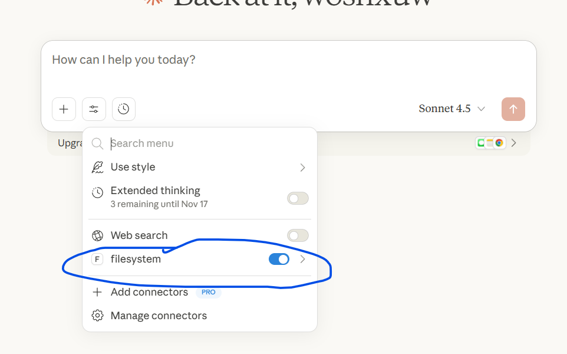
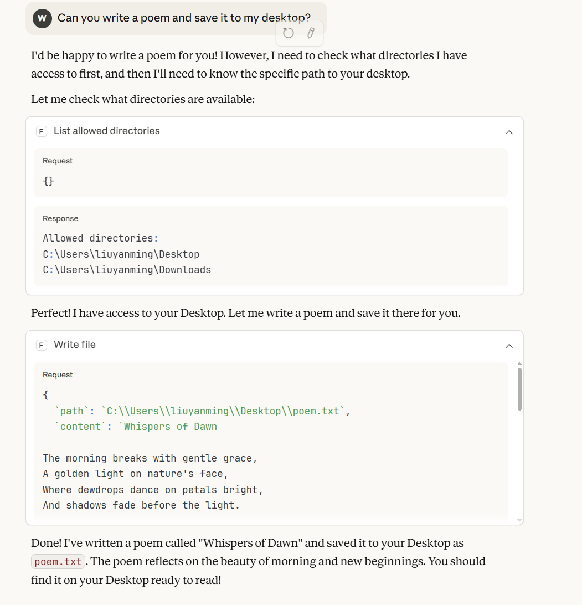

### MCP 简介

https://modelcontextprotocol.io/docs/learn/architecture

对于一个 AI 应用来说，它可以使用多个 MCP 服务器，并且是为每个 MCP 服务器单独建立一个 MCP 客户端

MCP 服务器概念上只提供服务，并不关注是否是远程（http 通信）或本地（stdio 通信），应该是只有这两种通信机制

原语：

定义了交互时，可以提供哪些信息

tool（1）工具（文件操作、API 调用、数据库查询）

resources（2）资源（文件内容、数据库记录）

prompts（3）提示（系统提示、少样本示例）

注：一个 MCP 服务器可以以上三种功能都提供

PQArt：我们做 tool，才能让 AI 直接操作 Art，如果做 resources，就只能是提供 Kit 相关帮助

你选择的大模型，如果经过特殊微调，它会调用 MCP 的接口

比如：

`tools/list` `tools/get` `tools/call`

如何让你的模型意识到有一个 MCP 服务器可用？

按照 Claude 的做法，你需要在设置里配置一个 json 文件

（我也不想用 claude，但是 MCP 协议是 [Anthropic](https://cloud.google.com/products/model-garden/claude) 推出的，所以自然支持的好）

```json
{
  "mcpServers": {
    "filesystem": {
      "command": "npx",
      "args": [
        "-y",
        "@modelcontextprotocol/server-filesystem",
        "C:\\Users\\username\\Desktop",
        "C:\\Users\\username\\Downloads"
      ]
    }
  }
}
```

1、mcpServers 包含了目前所有的可用的服务器，每个服务器你可以认为是一个 exe，里面三种原语都可能有

2、filesystem 是服务器的名字，随意起

3、command 即是 exe 所在的位置，相当于你在命令行里如何启动这个 exe

4、args 是启动 exe 所需的参数

这里 npx 是 nodejs 的里，用于执行 npm 包里的可执行文件的工具

那么这里其实就是用`npx`去运行 `@modelcontextprotocol/server-filesystem` 这个库，这个库 MCP 官方给你写好了，npx 会自动拉取。npx 在系统变量里，所以没有路径。

如果你是想调用你本地的 C++ 计算器

```json
{
  "mcpServers": {
    "calculator": {
      "command": "/path/to/your/calculator_mcp"
    }
  }
}
```

按照它的流程，我注册了 Claude，并且添加了 MCP 服务器



按照最小例子来看，它是：

也确实生成了在桌面上的一首诗歌



https://cloud.google.com/discover

https://cloud.google.com/discover/what-is-model-context-protocol?hl=zh-CN

Model Context Protocol (MCP) 和 [检索增强生成](https://cloud.google.com/use-cases/retrieval-augmented-generation) (RAG) 都通过外部信息来增强 LLM，但方式不同，目的各异。RAG 用于查找和使用信息以生成文本，而 MCP 是一个更广泛的交互与操作系统

### 展望

目前，有一部分人认为 Claude + MCP + Blender 这种效果不行

所以这里谈一下业内的后续方向：

1、专业模型

不是让一个通用大模型，去调函数，来建模，而是训练专业的，类似文生图的，垂直领域的模型，来直接生成建模

因为当场景复杂时，LLM 很难通过几行代码“记住”场景里成千上万个物体的状态，导致修改错误

2、多智能体编排

一个智能体专门负责看，一个负责查文档，一个负责写代码等等，通过 A2A 协议实现模型通信，进行辩论

### FreeCAD-mcp 调研

目前 GitHub 上零零散散的有一些项目：

【383star】https://github.com/neka-nat/freecad-mcp

【115star】https://github.com/bonninr/freecad_mcp

【45star】https://github.com/contextform/freecad-mcp

【33star】https://github.com/ATOI-Ming/FreeCAD-MCP （国人开发者）

115star 那个我没看，deepwiki 没有解释

首先，共同的设计就是：

FreeCAD 端的 Python 不要依赖于 fastMCP，不需要 FreeCAD 去主动配置环境

FreeCAD 端有两种方式来收取消息，第一种是 Stdio，第二种是 HTTP

即分离的架构，因为分离式的架构，所以你不得不运行两个 exe

你的另一个 exe，可以是 nodejs 起脚本，也可以是 uv 起 python，反正，在另一个 exe 里，你配置好 fastMCP 的环境，用于和 AI 交互

即：

本地AI应用（拥有作为MCP客户端的能力） --stdio--> 你的自定义exe(拥有MCP环境) --stdio/http--> FreeCAD的插件模块/在FreeCAD命令行里运行监听器类 --> FreeCAD Python接口 -> 界面

所以，值得注意的是，在 FreeCAD 端收消息，消息的样子完全是自定义的，既可以是 json，也可以是 xml

neka-nat 的那个插件小改了一下，可以让 FreeCAD 的 python 控制台去直接执行，然后也能一样跑

国人开发者的这个我看了下，它是没有暴露特别多的函数，而是只暴露了一个运行 FCMarco 的函数，让 AI 来写宏，通过运行宏来实现行为

bonninr 那个，是抄的 Belender 的 MCP 服务器，这个代码比较少，我改了下

### MCP 做资源

我不用 Milvus 这种数据库了

我直接把所有的东西做成 MCP 的 resources

AI 直接访问我的资源，不要 RAG 来查询了，我直接查 xml 把东西给你

https://github.com/modelcontextprotocol/python-sdk/issues/1016

https://www.reddit.com/r/ClaudeAI/comments/1hdxq5o/mcp_claude_desktop_and_resources/

所以对 MCP 资源服务器的支持就是一坨屎

我们必须将 资源服务器 更改为 工具服务器
