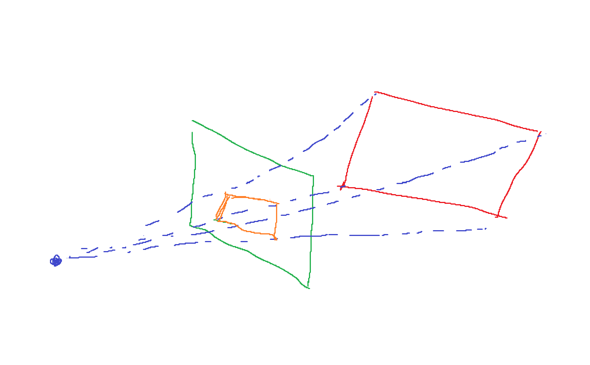

光栅化 Rasterization：把 3D 物体实时的显示在计算机屏幕上的过程

实时：至少 30fps

点积：用于求夹角，以及一个向量在另一个向量上的投影，或者说做分解

叉积：用于区分内外，左右。eg：一个向量在另一个的左还是右，一个点在三角形内（三次叉积同向） 

齐次坐标：通过对向量增加一个维度，使得不需要额外添加平移矩阵，而是直接用乘法就能乘出平移

变换：常见的有平移旋转放缩

绕原点旋转：如果我们会绕原点旋转，那么如果下一个旋转不在原点，我们可以把所有东西平移到原点，然后转，再移动回来

相机：（相机需要三个东西才能定义）
1、位置
2、上方向（不仅仅需要视线，是因为比如我拿着相机了，我还可以上下颠倒相机）
3、视线
（说是三个，但其实一个位姿矩阵就可以定义出，实际上相机就相当于一个人的眼，也是需要这三个方向）

简化：

我们用平移法，将相机移动到原点，上方向为 Y
看向-Z（右手系）
为什么看向-Z，因为要模拟人眼，当 Z 轴指向屏幕外，那么你的人眼看纸张，就是刚好看-Z 方向嘛

模型视图变换：模型全部移动到相机在原点时的相对位置

正交投影：假设相机离得无限远（实际上有点类似 正视图？）

透视投影：摄像机是一个点，形成一个锥

我不是很理解透视投影形成的原理，所以我这里再加深一下

首先人眼是一个透视投影，这个应该是生理结构决定的

眼睛的视网膜，约等于图形学里的屏幕，就是绿色的部分，也就是人的大脑感知的东西

摄像机似乎没有对应的生理结构，相当于大脑的感知

然后按照这幅图，假装屏幕前有一个倾斜的平面物体，则投影后，近的会更大，远的会更小

正交：按照相机在原点，看向-Z，你直接把物体的 Z 值扔掉，就是投影了（不考虑物体的前和后）

不考虑旋转，通过平移和缩放，把空间中任意一个长方体，变换到原点的标准正方体

这三步，称之为** MVP **变换

1、Model 模型变换：确定模型在世界中的位置

2、View 视图变换，顶点从世界空间变换到观察空间（相机空间），将所有物体转换到以相机为原点的坐标系中

3、Projection 投影变换，定义可视区域和投影方式，为后续透视除法和裁剪做准备

透视：

近和远的两个平面，近的平面小，远的平面大

近平面永远不变，远平面挤压成和近的一样大，远的 Z 不变，只是向里收缩

远平面的中心不变

什么意思：你可以把近平面想象成你的显示器，你就是摄像机，你在显示器上看到的物体

就是显示器后面物体，做透视投影的东西

视锥定义：

因为我们之前的绿色平面是随便画的，但是现实情况是它又有一个比例

长宽比

fov：在垂直方向上，最上和最下的夹角（游戏里可能是水平的，两者可以互相求）

屏幕的定义：
1. 像素的二维数组
2. 具有分辨率
3. 光栅化

屏幕空间，左下角是原点。但是其实现实中，一个像素点的中心，应该在 (x+0.5,y+0.5) 这里

现在的目标是：将标准正方体，画在屏幕上

不管 z 向，只管 xy，拉伸到屏幕，称之为**视口变换**

采样：

遍历屏幕里每个像素，取中心点，请问中心点在不在该现实的三角形内，在就显示，不在就不显示

在不在内部，之前叉积已经提过了

->其实可以只采样三角形的包围盒内的点

Aliasing（jaggies）

走样（锯齿）因为分辨率低

Artifacts：瑕疵。锯齿，摩尔纹，车轮效应

必须先对源做模糊，然后采样，才能避免锯齿。而不是先采样，再模糊

为什么会产生锯齿：

我们思考一个图片的傅里叶变换

如果频谱上，应用高通滤波，则会留下图片中的边界，即像素剧烈变化的位置

如果低通滤波，则会模糊

说明高频=边界

采样率高频谱上间隔大？

似乎就是频域产生重叠？

那么你先模糊，就是先降高频，你采样率不足时，才有效果

你先采样，那就还是先采高频，再滤波就没用了

当然，还有就是超采样即可

一个像素采样 16 个点，然后按覆盖率算亮度

并不是提高分辨率，实际上，为了性能，多个点可能复用

MSAA
AA 为 Anti Aliasing

可见性问题：

近的如何遮挡远的->深度缓冲，Z-buffering

一个笨办法是（画家算法）：先画远的，然后画近的，直接把远的盖住（覆盖）即可

问题：如果产生循环依赖的遮挡，就不清楚了

那么思路就转向：

给像素排序，每个像素，记录最小的深度

即，在渲染正常图片时，额外弄一个深度图，每个像素记录最小的深度，同时生成
深度=到相机距离绝对值，小的近

算法：

比如就取一个像素，你先渲染地板无所谓，先渲染地板，就记录地板，之后如果渲染了立方体，就更换为立方体（说明立方体遮挡地板）

没有那么复杂，就是永远拿最近的三角片，深度缓冲区只是一个记忆。类似找一个序列里最大的数，也得用 mymax 来记忆

优势：顺序无关系（三角）

比如你去街上 10 个商店买最便宜的，你并不需要按顺序走完商店，只需要走完 10 个，记得哪个最便宜即可

通过上面内容，我们已经可以渲染一个三角片了

但是三角片一直是一个颜色（边缘通过反锯齿有渐变），但是总体还是一个颜色

shade n. 阴影

Shading：着色

着色：引入明暗和颜色的不同/对不同物体应用不同材质

为什么不同的球能看出来？因为不同的材质对光照有不同的算法

在一个需要着色的点上，局部极小平面

1、法线 n

2、观测方向 v

3、光照方向 l（指向光源）

点本身也有一些属性

着色时，每个点，只看自己，不考虑阴影

即一个点因为一些其它原因，处于其它物体的阴影内，不考虑

即局部光照，这样明暗变化就分明了

1、漫反射：

按照余弦定律 能量和光线法线夹角余弦正比

光源的能量：按照能量守恒，能量假设一直在一个球壳上，那就是越远越少

假设距离 1，强度是 I

根据球壳面积，应该和距离平方成反比

收到的能量 = 余弦，距离，材质（吸收率，因为点有颜色）

如果均匀反射，那么不管从哪看，都是一样的（漫反射，和视线 v 没有关系）

2、高光

假装它是镜子，镜面反射

当视向和反射很接近 = 法线和半程向量很接近

半程向量是 视向和光线方向的角平分线

此时就不考虑 l 和 n 相乘了

3、环境光

某些点无法被光直射

我们假设任何一个点，接受环境光都是相同的，来自四面八方

因此和你观测的方向没关系

实际上就是一个常数

着色频率：

之前，着色应用在一个点上

现在

1、一个平面直接用一个点的着色结果（Flat Shading），一个三角片一个颜色（当模型复杂，面很多时，不一定会很差）

2、每个平面，按照顶点着色，然后三角形内进行插值过渡。（Ground Shading）--> 法线怎么求？

3、三角形内真正每一个像素上，进行着色（Phong Shading）

求法线：

1、三角片顶点的法线，是相邻面法线的加权平均（权是三角形面积）

2、逐像素法线？

因为三个顶点的法线知道了，三角形内部一个法线，可以通过插值求

把以上所有东西，模型，光照，渲染，合并到一起，叫做渲染管线

管线：从场景到一个图，到底发生了什么

第一步之所以是一些点，其实可能本身这些点是原来模型的顶点

控制这个流程的东西，就叫做 shader

还要注意他们可能混淆了光栅化和着色的顺序，或者觉得着色必须放在光栅化之后。需要说明现代 GPU 的灵活性，比如片段着色器在光栅化之后，但顶点着色在前，这样他们能明白流程的弹性。

### 1. 光栅化

**核心任务：** 将三维空间中的**图元**（主要是三角形）转换为二维屏幕上的**像素**。

**过程描述：**

1. **输入：** 经过顶点处理（如模型变换、视图变换、投影变换）后的顶点数据，这些顶点已经组成了三角形，并且位于一个标准化的裁剪空间内。
2. **坐标转换：** 将裁剪空间中的顶点坐标转换为屏幕空间的二维坐标。
3. **确定覆盖范围：** 对于屏幕上的每一个像素，判断它是否被某个三角形所覆盖。这个过程不是简单地画线，而是确定哪些像素的中心点落在三角形的内部。
4. **输出：** 生成一系列**片段**。一个片段可以理解为一个“候选像素”，它包含了颜色、深度、纹理坐标等信息，但还没有最终成为屏幕上的像素。

**简单比喻：**
光栅化就像一个**模板切割器**。你给它一个三角形的图纸（顶点），它会在画布（屏幕）上精确地找出所有需要被这个三角形覆盖的格子（像素）。

------

### 2. 着色

**核心任务：** 计算每个**片段**（由光栅化产生）的最终颜色。

**过程描述：**

1. **输入：** 光栅化阶段产生的**片段**，以及该片段所关联的各种数据，如顶点颜色、法线、纹理坐标、材质属性等。
2. **应用光照和材质模型：** 根据场景中的光源信息（位置、颜色、强度）和物体表面的材质属性（漫反射、高光、粗糙度等），通过一个数学模型（如 Phong、Blinn-Phong 或更复杂的 PBR 模型）计算该点应该呈现的颜色。
3. **纹理采样：** 根据片段的纹理坐标，从纹理贴图中获取颜色值，并将其应用到计算中。
4. **输出：** 每个片段的最终颜色值。这个颜色值随后会经过一系列测试（如深度测试、模板测试），最终决定是否以及如何写入帧缓冲区，成为屏幕上我们看到的一个像素。

**简单比喻：**
着色就像一个**画家或上色师**。他拿到模板切割器（光栅化）标记好的那些格子，然后根据光照条件、物体的材质和图案（纹理），决定给每个格子涂上什么精确的颜色。

shader 是一些硬件能够执行的东西

每一个像素，都执行相同的语句

如果你写顶点的，就叫 vertex shader

如果写像素，就是 fragmenr shader（片段着色器）

纹理映射：

之前我们都是单一颜色的

现在我们有木板，这个木板是有纹路的，所以需要实时的更改每个点的反射系数

纹理图上通常用 uv 坐标，不管这个东西是不是正方形，分辨率，uv 取值都是 0 到 1

tiled 纹理（自复制无缝衔接）

普通光栅化的原理是：

从光源发出一束光，然后打到物体上，假装在局部平面做镜面反射

看反射光线和视线的夹角，求光照强度

仅反射一次，计算简单

光线追踪的原理：

由于光路的可逆性，假装从人眼发出光线

人眼作为光源，向屏幕中每个像素点做投影

然后，每次该光线打到一个物体上，都做局部平面做镜面反射（或折射）

关键在于，同时计算能量损失，比如反射一次，损失为原来的 50%

反射光和折射光继续传播，递归运算，直到能量小于某个阈值

此后，将所有反射点考虑，如果该点能被真实光源照到，则计算

最后按照加权的方式，求出该像素的光照

为了减少光追的计算压力，我们会给空间进行划分：

（如果你无法想象空间，则你可以想象二维平面内的划分）

oct-tree 八叉树

每个象限等分

kd-tree

每次只划分一刀

这次 x 下次 y 再下次 z，每次划分点不是等分点，而是可以考虑更合理的比例