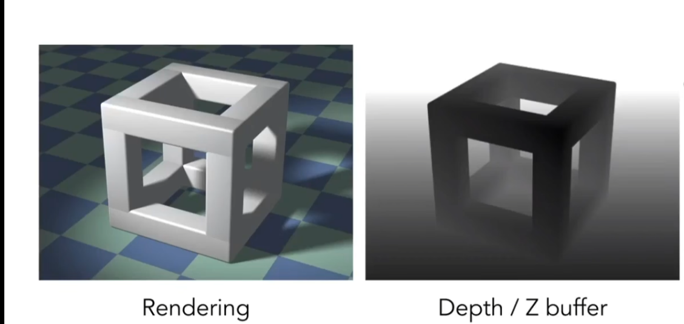
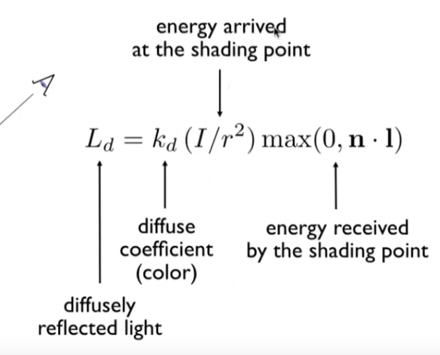
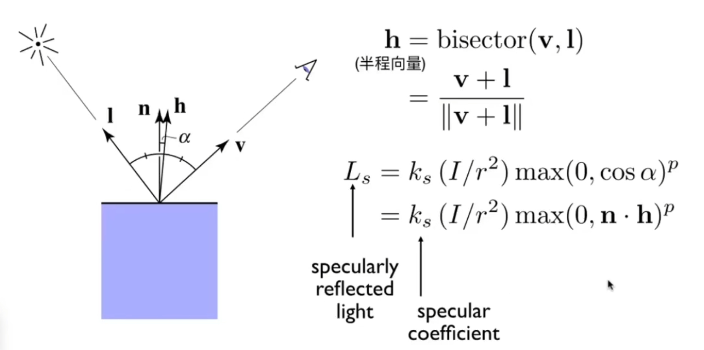
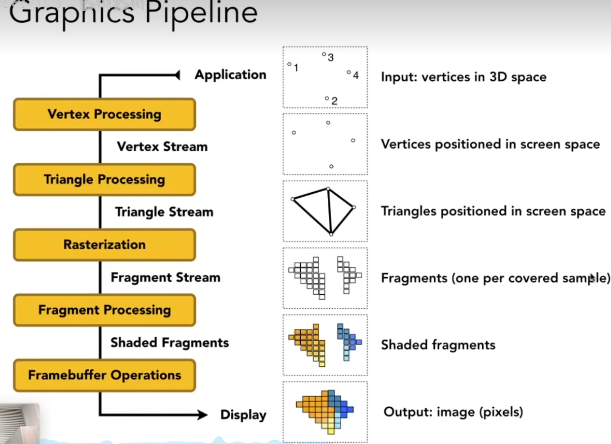

### 数学基础

点积：用于求夹角，以及一个向量在另一个向量上的投影，或者说做分解。

叉积：用于区分内外，左右。eg：一个向量在另一个的左还是右，一个点在三角形内（三次叉积同向） 

齐次坐标：通过对向量增加一个维度，使得不需要额外添加平移矩阵，而是直接用乘法就能乘出平移。

变换：常见的有平移、旋转、放缩。

绕点旋转：已知我们已经会做绕原点旋转。如果下一个旋转不在原点，我们可以把旋转点先平移到原点，然后转，再移动回来。

### 光栅化

光栅化 Rasterization：把 3D 物体实时的显示在计算机屏幕上的过程

实时：至少 30 fps

### 相机

相机：（相机需要三个东西才能定义）

1、位置

2、上方向（不仅仅需要视线，是因为比如我拿着相机了，我还可以上下颠倒相机）

3、视线

（说是三个，但其实一个位姿矩阵就可以定义出，实际上相机就相当于一个人的眼，也是需要这三个方向）

简化：

我们用平移法，将相机移动到原点，上方向为 Y，看向 -Z（右手系）

为什么看向 -Z，因为要模拟人眼，当 Z 轴指向屏幕外，那么你的人眼看纸张，就是刚好看 -Z 方向

### 成像原理

图形学的成像，类似小孔成像。

相机就相当于现实世界里小孔成像的小孔。

根据光路可逆性，实际上是从屏幕上的每一个像素点射出一条光线，经过小孔，打到虚拟世界中的一个物体的表面上，观察其颜色。

屏幕距离小孔的距离决定了 FOV，如果把屏幕替换为你的眼睛，那么很显然，你距离小孔越近，你能看到的范围也就越大。

其实再思考一下，屏幕实际上也在虚拟世界里有一个位置的。

### 视图变换

模型视图变换：模型全部移动到相机在原点时的相对位置

**透视投影**：相机是一个点，形成一个锥。好比我们前面说的小孔成像原理。

透视形成的根源是距离物体的远近，导致物体在视野里所占的角度发生了变化。它和凸透镜没有必然关联。

人眼类比的话，晶状体是一个凸透镜，成像平面是视网膜。和单反相机类似，镜头组是凸透镜，成像平面是 CMOS。但是计算机图形学里，它是类似小孔成像，所以并不好直接对比。

近大远小本质就是近的物体，在视锥体的，所占的角度更大（通过三角函数）。

**正交投影**：假设相机离得无限远。

正交投影理解：

如果你硬要在此处找一个屏幕的话，那么屏幕也是在无穷远，因为无穷远，所以光线经过小孔依然平行。

其实正交投影类似于平行光线/太阳光线打到物体上，或者一个液压机将物体压扁。

按照相机在原点，看向 -Z，你直接把物体的 Z 值扔掉，就是正交投影了（不考虑物体的前和后），类似丢掉一个维度（因为本质是物体的深度，即离你的远近，决定了透视关系种的占比的角度）

### MPV 变换

不考虑旋转，通过平移和缩放，把空间中任意一个长方体，变换到原点的标准正方体

这三步，称之为** MVP **变换

1、Model 模型变换：确定模型在世界中的位置。这一步其实就是获取世界坐标系，因为很多物体都只记录基于父亲的局部坐标，需要把它们乘起来。【世界坐标】

2、View 视图变换：顶点从世界原点变换到观察空间（相机空间），将所有物体转换到以相机为原点的坐标系中。即求相对摄像机的位置。【观察坐标】

3、Projection 投影变换：将观察坐标转换为裁剪坐标。定义可视区域，并将 3D 坐标压扁到 2D 平面上。通常分为透视投影和正交投影。【裁剪坐标】

### 可视区域

视锥定义：

视锥体是只能在透视投影里用。因为小孔成像，所以视锥顶点相当于相机。

视景体定义：

视景体是只能在正交投影里用。类似于一个长方体，相当于直接从虚拟屏幕上，每个像素发射平行光线。

长宽比：屏幕的 16：9 这种参数

fov：在垂直方向上，最上和最下的夹角，这跟角度一般在 50~60（FPS 游戏里可能是水平的，因为 FPS 里很多 fov 都在 100 左右，两者可以互相求。所以 FPS 游戏是透视投影，也只有透视投影才有 fov。）

### 裁剪平面

无论是视锥体和视景体，都不是无限的。它都是有限长方体或者平头锥体，具有远近两个裁剪平面。

我们之前提到，我把虚拟屏幕放在了小孔后面，但是这样像是颠倒的。

所以现实情况是，反而把屏幕放在了相机前面，类似相机作为一个“黑洞”，吸引了一下所有的物体表面的颜色，最后被屏幕这张白纸挡住。

裁剪平面的存在，其根本原因是应对计算机世界，浮点数的精度有限。

近裁剪平面，可以避开极其接近相机的三角形。远裁剪平面，可以避开离得特别远的三角形。从深度缓冲区来考虑，避免极远的物体深度过大。

近裁剪平面：在第一人称里一般设置的很近，1cm，毕竟需要看武器（有时候物体和手套会关闭深度检测）。第三人称可能稍远。但是第三人称的摄像机和人物分离，如果你真能把相机紧贴在一个墙体后面，那确实能穿过。但是，相机外围有一个碰撞球，球的半径大于近裁剪平面，这导致还没出现异常，相机就闪开了。

包括相机无法一直拉近角色面部，拉近到某种程度就卡住了。这也是为了近的精度不至于太多，远处崩了。

### 视口变换

屏幕定义：
1. 像素的二维数组
2. 具有分辨率
3. 光栅化

屏幕空间，左下角是原点。但是其实现实中，一个像素点的中心，应该在 (x+0.5,y+0.5) 这里。

经过了 MPV 变换，你的内容已经在一个标准的正方体以内。现在的目标是：将标准正方体，画在屏幕上。（说是正方体，其实是两个正方形，一个是投影变换后的二维图形，另一个是深度缓冲区？）

不管 z 向，只管 xy，拉伸到屏幕，称之为**视口变换**

### 采样、抗锯齿

在图形学里，都是三角面片。你的三角面片经过 MPV 变换，压缩到一个标准正方形里。再缩放到和屏幕一样大。

遍历屏幕里每个像素，取中心点，请问中心点在不在该显示的三角形内，在就显示，不在就不显示。

计算在不在内部，之前叉积已经提过了 -> 其实可以只采样三角形的包围盒内的点

Aliasing（jaggies）

走样（锯齿）因为分辨率低

Artifacts：瑕疵。锯齿，摩尔纹，车轮效应

必须先对源做模糊，然后采样，才能避免锯齿。而不是先采样，再模糊

为什么会产生锯齿：

我们思考一个图片的傅里叶变换

如果频谱上，应用高通滤波，则会留下图片中的边界，即像素剧烈变化的位置

如果低通滤波，则会模糊

说明高频=边界

采样率高频谱上间隔大？

似乎就是频域产生重叠？

那么你先模糊，就是先降高频，你采样率不足时，才有效果

你先采样，那就还是先采高频，再滤波就没用了

当然，还有就是超采样即可

一个像素采样 16 个点，然后按覆盖率算亮度

并不是提高分辨率，实际上，为了性能，多个点可能复用

MSAA

AA 为 Anti Aliasing

### 深度缓冲

可见性问题：

近的如何遮挡远的 -> 深度缓冲，Z-buffering

一个笨办法是（画家算法）：先画远的，然后画近的，直接把远的盖住（覆盖）即可

问题：如果产生循环依赖的遮挡，就不清楚了

那么思路就转向：

给像素排序，每个像素，记录最小的深度

即，在渲染正常图片时，额外弄一个深度图，每个像素记录最小的深度，同时生成
深度=到相机距离绝对值，小的近

算法：

比如就取一个像素，你先渲染地板无所谓，先渲染地板，就记录地板，之后如果渲染了立方体，就更换为立方体（说明立方体遮挡地板）

没有那么复杂，就是永远拿最近的三角片，深度缓冲区只是一个记忆。类似找一个序列里最大的数，也得用 mymax 来记忆

优势：顺序无关系（三角）

比如你去街上 10 个商店买最便宜的，你并不需要按顺序走完商店，只需要走完 10 个，记得哪个最便宜即可

通过上面内容，我们已经可以渲染一个三角片了

### 着色

但是三角片一直是一个颜色（边缘通过反锯齿有渐变），但是总体还是一个颜色

shade n. 阴影

Shading：着色

着色：引入明暗和颜色的不同/对不同物体应用不同材质

为什么不同的球能看出来？因为不同的材质对光照有不同的算法

在一个需要着色的点上，局部极小平面

1、法线 n

2、观测方向 v

3、光照方向 l（指向光源）

点本身也有一些属性

着色时，每个点，只看自己，不考虑阴影

即一个点因为一些其它原因，处于其它物体的阴影内，不考虑

即局部光照，这样明暗变化就分明了

1、漫反射：

按照余弦定律 能量和光线法线夹角余弦正比

光源的能量：按照能量守恒，能量假设一直在一个球壳上，那就是越远越少

假设距离 1，强度是 I

根据球壳面积，应该和距离平方成反比

收到的能量 = 余弦，距离，材质（吸收率，因为点有颜色）

如果均匀反射，那么不管从哪看，都是一样的（漫反射，和视线 v 没有关系）

2、高光

假装它是镜子，镜面反射

当视向和反射很接近 = 法线和半程向量很接近

半程向量是 视向和光线方向的角平分线

此时就不考虑 l 和 n 相乘了

3、环境光

某些点无法被光直射

我们假设任何一个点，接受环境光都是相同的，来自四面八方

因此和你观测的方向没关系

实际上就是一个常数

着色频率：

之前，着色应用在一个点上

现在

1、一个平面直接用一个点的着色结果（Flat Shading），一个三角片一个颜色（当模型复杂，面很多时，不一定会很差）

2、每个平面，按照顶点着色，然后三角形内进行插值过渡。（Ground Shading）--> 法线怎么求？

3、三角形内真正每一个像素上，进行着色（Phong Shading）

求法线：

1、三角片顶点的法线，是相邻面法线的加权平均（权是三角形面积）

2、逐像素法线？

因为三个顶点的法线知道了，三角形内部一个法线，可以通过插值求

把以上所有东西，模型，光照，渲染，合并到一起，叫做渲染管线

### 管线

从场景到一个图，到底发生了什么

第一步之所以是一些点，其实可能本身这些点是原来模型的顶点

控制这个流程的东西，就叫做 shader

shader 是一些硬件能够执行的东西

每一个像素，都执行相同的语句

如果你写顶点的，就叫 vertex shader

如果写像素，就是 fragmenr shader（片段着色器）

纹理映射：

之前我们都是单一颜色的

现在我们有木板，这个木板是有纹路的，所以需要实时的更改每个点的反射系数

纹理图上通常用 uv 坐标，不管这个东西是不是正方形，分辨率，uv 取值都是 0 到 1

tiled 纹理（自复制无缝衔接）

普通光栅化的原理是：

从光源发出一束光，然后打到物体上，假装在局部平面做镜面反射

看反射光线和视线的夹角，求光照强度

仅反射一次，计算简单

### 光线追踪

原理：光路的可逆性。

假装从人眼（摄像机）发出光线

摄像机作为光源，向屏幕中每个像素点做投影

然后，每次该光线打到一个物体上，都做局部平面做镜面反射（或折射）

关键在于，同时计算能量损失，比如反射一次，损失为原来的 50%

反射光和折射光继续传播，递归运算，直到能量小于某个阈值

此后，将所有反射点考虑，如果该点能被真实光源照到，则计算

最后按照加权的方式，求出该像素的光照

为了减少光追的计算压力，我们会给空间进行划分：

（如果你无法想象空间，则你可以想象二维平面内的划分）

oct-tree 八叉树

每个象限等分

kd-tree

每次只划分一刀

这次 x 下次 y 再下次 z，每次划分点不是等分点，而是可以考虑更合理的比例