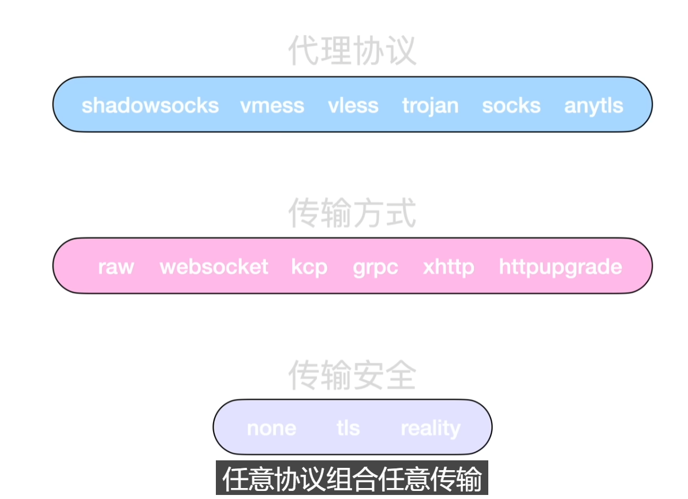

# VPN 协议一览

此文章有效性截止到 2026 年 5 月，用 AI 整理了一下（现在协议太多，我没时间一个个看了）

## 协议

这里的“协议”主要指客户端和远端服务器之间真正承载代理流量的协议。

### VLESS

热度：高。Xray 生态的主力。

定位：轻量代理协议，只负责身份认证和代理语义；UUID 主要用于识别用户，不负责加密。

现在怎么看：

- VLESS 本身不加密，必须搭配 TLS、REALITY 等安全层，否则就是裸奔。
- V2Fly 侧已经把 VLESS 标成不推荐新部署；Xray 侧仍然围绕 VLESS 继续发展。
- 现在常见重点不是“纯 VLESS(TLS + TCP)”，前者已经被 V2Ray 标记为废弃，而是 `VLESS + RAW/XHTTP + Vision/REALITY`。

常见组合：

- `VLESS + RAW(TCP) + REALITY + xtls-rprx-vision`
- `VLESS + XHTTP + TLS/REALITY`
- `VLESS + WS/gRPC + TLS`，较传统，多见于机场和 CDN 节点。

VLESS 是骨架，REALITY / TLS / XHTTP 才是现在真正决定可用性和伪装效果的部分。

### Hysteria2

歇斯底里。

热度：高。QUIC/UDP 系代表。

定位：基于 QUIC 的代理协议，同时处理 TCP 和 UDP 代理流量。

现在怎么看：

- 优点是速度好、抗丢包强，弱网或跨境 UDP 条件好时体验非常明显。
- 可以伪装成 HTTP/3，支持 Salamander 混淆。
- 不能像 WebSocket 那样随便套传统 CDN；它认证成功后会切到自定义代理语义，CDN 一般无法理解。

适合场景：服务器和客户端之间 UDP 质量不错，追求速度和抗丢包。

### TUIC v5

热度：中高。QUIC 系代表之一。

定位：基于 QUIC 的 TCP/UDP 代理协议，强调 0-RTT、UDP 代理和连接迁移。

现在怎么看：

- 和 Hysteria2 同属 UDP/QUIC 路线。
- 协议目标更偏简洁、标准化、可实现性。
- 生态不如 VLESS/Xray 大，但 sing-box、mihomo 等客户端已有支持。

### Shadowsocks / Shadowsocks 2022

热度：中。历史地位高，仍常见。

定位：加密的分流代理协议。老 SS 是整个代理生态的起点之一。

现在怎么看：

- 老 Shadowsocks 很轻，但单独使用时特征和抗探测能力有限。
- Shadowsocks 2022 不是简单换个加密方式，而是补了 replay protection、UDP session、BLAKE3 等设计。
- SS 常和插件、ShadowTLS、simple-obfs 等搭配，而不是单靠自己伪装。

### Trojan

特洛伊木马。

热度：中。稳定、直观，但不是最热的新方向。

定位：把代理连接伪装成正常 HTTPS 服务。

现在怎么看：

- 比 VMess/VLESS 更容易理解：客户端用密码认证，外面看起来像 HTTPS。
- 需要真实域名和证书，通常会配一个正常网站作为 fallback。
- 现在仍然可用，但新玩法不如 VLESS + REALITY / XHTTP 多。

### VMess

热度：低到中。老 V2Ray 时代主力，现在更偏遗留。

定位：V2Ray 原生代理协议，自带加密和认证，依赖时间同步。

现在怎么看：

- 新版 VMess 使用 AEAD，旧的 MD5 认证已经是兼容遗留。
- 如果再套 TLS，就容易形成 TLS in TLS，多一层加密和流量特征。
- 新部署通常会优先考虑 VLESS、Trojan、Hysteria2、TUIC 等。

### WireGuard

热度：高，但它是严格意义上的 VPN 协议。

定位：三层 VPN 隧道，不是普通代理协议。它接管 IP 层流量，而不是只代理应用连接。

现在怎么看：

- 商业 VPN 领域的事实主流之一，轻量、快、实现简单。
- 原始 WireGuard 流量比较容易被识别，所以常见新方向是给 WireGuard 外面再加混淆层。
- 典型外层包括 TCP、QUIC、MASQUE、Shadowsocks、厂商自研 Stealth 类协议。

WireGuard 解决的是“整机网络隧道”，VLESS/Hysteria2/TUIC 解决的是“代理连接”。

### Juicity

热度：低到中。知道即可。

定位：受 TUIC 启发的 QUIC 代理协议。

现在怎么看：

- 目标是更稳定的 QUIC 代理实现和更好的 UDP 处理。
- 生态和客户端支持比 Hysteria2、TUIC 更小。

### Mieru

热度：低到中。偏小众。

定位：不依赖 TLS、不要求域名和假站的代理协议，目标是 hard to classify / hard to probe。

现在怎么看：

- 思路和 REALITY / Trojan 不同：它不是伪装成 HTTPS，而是让流量难以分类。
- 支持 TCP/UDP，客户端本地提供 SOCKS5 / HTTP / HTTPS 代理入口。

Mieru 是“非 TLS 伪装路线”的代表。

## 传输层

代理协议的数据，具体包在什么连接形态里传过去。

### XHTTP

热度：高。Xray 新重点。

定位：Xray 的新一代 HTTP 传输层，目标是替代很多 WS/gRPC/HTTP 玩法。

现在怎么看：

- 支持 H1 / H2 / H3，可以穿过很多 HTTP 中间盒、反代、CDN。
- 核心思路包括分包上行、流式下行、流式上行、header padding、XMUX。
- 可以做上下行分离，例如上行和下行走不同网络路径。
- 常与 VLESS、TLS、REALITY 搭配。

模式记忆：

- `packet-up`：上行拆成多个 POST，下行流式 GET，兼容性最强。
- `stream-up`：上行和下行都流式，效率更好。
- `stream-one`：单个请求里双向流式。

XHTTP 是传输层（虽然它带有 HTTP 字眼，然而其实不是应用层），解决的是“怎么更像真实 HTTP 流量、更好穿中间盒”。

### RAW / TCP

热度：高。基础形态。

定位：直接跑在 TCP 连接上。Xray 新文档里 `tcp` 更名为 `raw`，两者兼容。

现在怎么看：

- 最简单，性能好，少一层中间封装。
- 单独使用没有伪装能力，需要 TLS / REALITY。
- `VLESS + RAW + REALITY + Vision` 是当前重要组合。

### WebSocket

热度：中。传统 CDN 玩法仍常见。

定位：把代理流量包进 WebSocket 连接里。

现在怎么看：

- 最大优点是 CDN 和反代支持广，老客户端兼容好。
- 缺点是用的人太多，形态也更老，容易变成“传统机场味”。
- 仍适合兼容场景，但不是 Xray 新玩法的重点。

### gRPC

热度：中。曾经很热，现在被 XHTTP 分流。

定位：基于 HTTP/2 的传输方式。

现在怎么看：

- 比 WebSocket 更现代，适合 H2 和反代场景。
- 传统 gRPC 容易长时间复用同一条连接，行为比较固定。
- XHTTP 的 `stream-up` 已经吸收了不少 gRPC 场景，还加了 padding、XMUX 等能力。

gRPC 是上一代 H2 传输主力；XHTTP 是更灵活的新替代。

### HTTPUpgrade

热度：中。简洁替代品。

定位：利用 HTTP Upgrade 机制建立代理传输。

现在怎么看：

- 比 WebSocket 更轻，配置也常见于新脚本。
- 生态和讨论热度不如 XHTTP。
- 可以理解为“HTTP 系传输层中的一个较轻方案”。

HTTPUpgrade 是 WS/gRPC/XHTTP 之间的一个中间选项。

### QUIC / HTTP/3

热度：高，但要分清层次。

定位：UDP 之上的现代传输协议；HTTP/3 跑在 QUIC 上。

现在怎么看：

- Hysteria2、TUIC、Juicity 是直接基于 QUIC 的代理协议。
- XHTTP 也可以走 H3，让 HTTP 传输层跑在 QUIC 上。
- QUIC 有连接迁移、无 TCP 队头阻塞等优势，但 UDP 在某些网络会被限速或阻断。

QUIC 可以是协议自己的底座，也可以是 HTTP/3 传输层的底座。

## 伪装与安全层

这一层回答的问题是：外面看到的流量像不像正常流量，以及连接是否安全。

### REALITY

热度：高。Xray 当前核心技术之一。

定位：Xray 的 TLS 伪装和认证方案，不需要自己持有目标网站证书。

现在怎么看：

- 外部看起来像访问真实网站，认证失败的连接会回落到目标站点。
- 常与 `VLESS + RAW + Vision` 或 `VLESS + XHTTP` 搭配。
- 依赖合适的 `serverName`、目标站点、shortId、密钥等配置。
- 新版还涉及 uTLS 指纹、后量子相关字段、fallback 限速等。

REALITY 不是传输层，也不是代理协议；它是“让 TLS 握手看起来真实”的安全/伪装层。

### TLS

热度：高。基础安全层。

定位：标准传输层安全协议。Trojan、VMess/VLESS over WS、gRPC、XHTTP 等都可搭配 TLS。

现在怎么看：

- 需要域名和证书，优点是标准、兼容、容易过反代/CDN。
- 只开 TLS 不代表完全像浏览器；TLS 指纹、HTTP 行为、连接复用方式仍可能有特征。
- VMess 再套 TLS 时，会出现“协议内加密 + TLS”的双层加密问题。

TLS 提供标准安全外壳，但“像不像真实浏览器”还取决于上层行为。

### uTLS 指纹

热度：高。伪装细节里很重要。

定位：模拟浏览器 TLS ClientHello 指纹。

现在怎么看：

- 常见可选指纹包括 Chrome、Firefox、Safari、iOS、Android 等。
- 它只模拟 TLS 握手的一部分，不等于完整浏览器行为。
- REALITY、TLS 出站配置中经常会看到 `fingerprint: chrome` 之类参数。

uTLS 解决的是“握手像不像浏览器”，不解决“后续 HTTP 行为像不像浏览器”。

### ECH

热度：中高。趋势重要，但部署依赖现实生态。

定位：Encrypted Client Hello，用来隐藏 TLS ClientHello 里的敏感信息，尤其是 SNI。

现在怎么看：

- 标准 HTTPS 生态也在推进 ECH。
- Xray 已有相关配置字段。
- 实际效果依赖 DNS HTTPS 记录、服务端支持和客户端实现。

ECH 是未来 HTTPS 隐私趋势之一，不是代理圈独有发明。

### XTLS Vision

热度：高。常和 VLESS/REALITY 一起出现。

定位：Xray 的**流控/优化**方案，常见参数是 `flow=xtls-rprx-vision`。

现在怎么看：

- 常出现在 `VLESS + REALITY + RAW` 组合里。
- 目标是减少额外封装和性能损耗，让代理流量处理更高效。
- 它不是独立协议，也不是安全层本身，更像 Xray 体系里的流控模式。

### ShadowTLS

热度：中。常作为 SS 的外层伪装。

定位：暴露真实 TLS 握手给审查者，使用别人可信证书的 TLS 伪装代理。

现在怎么看：

- 它本身不负责加密代理内容，也不负责代理请求语义。
- 通常和 Shadowsocks 这类加密代理搭配。
- 思路接近 Trojan/REALITY 的“看起来像真实 TLS”，但实现层次不同。

### NaiveProxy

热度：中。小众但思路很清晰。

定位：复用 Chromium 网络栈，让代理流量更像真实 Chrome。

现在怎么看：

- 使用 HTTP/2 或 HTTP/3 CONNECT。
- 重点不是自己设计奇怪协议，而是借 Chrome 的 TLS 指纹、H2 行为和网络栈。
- 服务端常用 Caddy forwardproxy 或 HAProxy 等前端。

NaiveProxy 的核心优势是“像 Chrome”，不是“参数很多”。

### CDN / 反代

热度：高。不是协议，但经常决定节点形态。

定位：把代理服务藏在正常网站、反向代理或 CDN 后面。

现在怎么看：

- 传统组合是 WS/gRPC + TLS + CDN。
- XHTTP 试图更系统地穿透 HTTP 中间盒和 CDN。
- Hysteria2/TUIC 这类 QUIC 代理协议通常不能按传统 HTTP CDN 思路随便套。

CDN 是部署环境，不是协议层；它会反过来限制你能选哪些传输方式。

### SOCKS / HTTP 入站

问题：搭代理时会看到 socks、vmess，而环境变量又把 `socks_proxy` 和 `http_proxy` 写在一起。

SOCKS 是一个通用转发代理协议，转发字节流，关注 IP 和端口。

HTTP 一开始是 Web 协议，后来发展出 HTTP 代理。客户端可以对 HTTP 代理服务器说：帮我取这个 URL。

在代理软件里，代理既有流量进入，也有流量传出。SOCKS 和 HTTP 常用于本地入站，VLESS / VMess / Trojan 等常用于远端出站。

### WebRTC 泄漏

Chrome 需要安装扩展来避免 WebRTC 泄露。

VPN/代理通常只影响浏览器的普通 HTTP(S) 流量，但 WebRTC 的 STUN 请求可能绕过这些路径，从而暴露真实地址。STUN 也是应用层协议，和 HTTP 平级。

测试网站：https://ippure.com/
