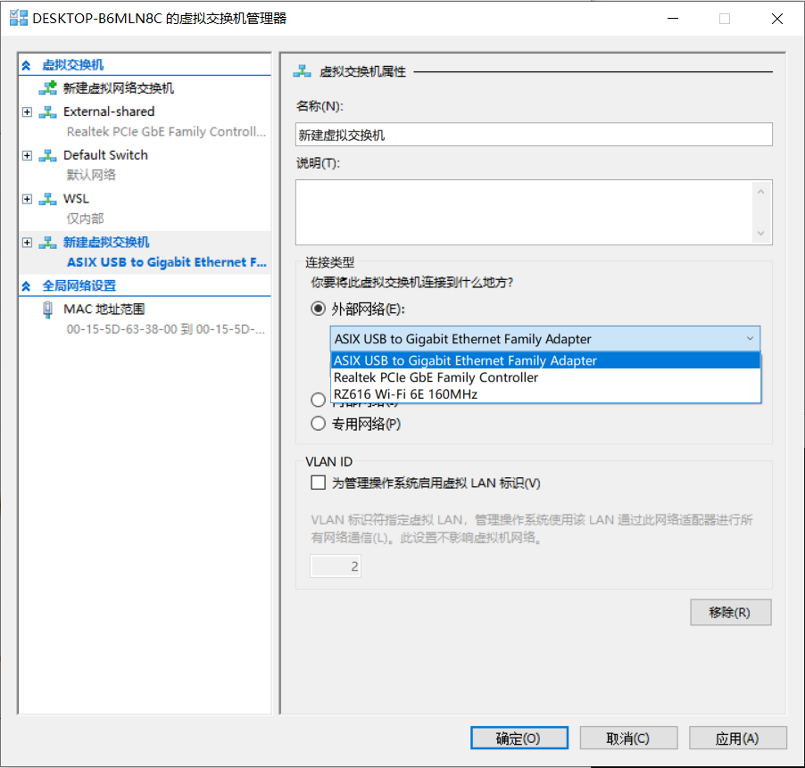

这个文章准备闹明白我电脑上的网路拓扑

我的一台 Windows 电脑，上面只有一个物理网卡，通过网线连接路由器。

然后我开启了 Hyper-V，创建了一个 Linux 虚拟机。

我又利用 Hyper-V 创建了 Docker。

电脑里还有 v2ray 代理软件，并且有可能打开 TUN 模式。

最后，我还有 Tailscale 的服务。

### 网卡

首先，一个电脑从理论上就是可以配置两个网卡的（你想想你笔记本肯定有 wifi 接口吧）

在最简单的情况下，系统会为每个网卡分配独立的 IP 地址，并提供路由表管理来决定不同目的的网络流量走哪张网卡

比如内网流量走内网网卡，外网流量走外网网卡

Win 通过 `route print` 命令能看的比较详细

### Hyper-V 的模式

Hyper-V 右边可以管理虚拟机交换器。分为外部、内部、专用三种，并且默认提供一个叫做 Default Switch 的交换机

专用网络：很少用。虚拟机完全无法上网。

内部网络：似于 NAT 模式。Default Switch，WSL 就是这个。（Default Switch，这个底下也标注了是自动采取 NAT）你也可以再新建新的。

外部网络：关键在于，它必须先选一个物理网卡

底下的“允许管理操作系统共享此网络适配器”的意思是：管理操作系统就是指你开启 Hyper-V 管理器的那个 OS，也就是 windows。共享是指，是 win 和 linux 一起用这个物理网卡，还是 linux 可以独占网卡。如果你有两个网卡，你可以不勾，然后 linux 走网卡，win 走 wifi。

### 外部网络拓扑

如果是最开始，那么你的网络拓扑是：

Windows -> 物理网卡 -> 路由器 -> Internet

现在则是，物理网卡充当交换器：

Windows -> 虚拟网卡 -> | -> 虚拟交换器（由物理网卡充当） -> 路由器 -> Internet
Linux -> 虚拟网卡 ->   |

我们可以很明显的发现，路由器通过 DHCP 服务，给 Linux 分配了 ip 地址

我们在 linux 上检查 mac 地址为 00:15:5d:63:38:07，发现它是一个假 mac

而在 Windows 上检查 mac 地址为 C4-C6-E6-34-C1-3F，依然是网卡的 mac

因此我怀疑：

（1）hyper-V 会让主机把原来网卡的 mac 抄过来，网卡此时透明了

（2）在任务管理器里，他会让虚拟网卡的名字，和虚拟交换器同名

（3）对于 Router 来说，是有一个新的虚拟的 mac 地址加入，因此给 Linux 发了 ip，但是它看不到交换器