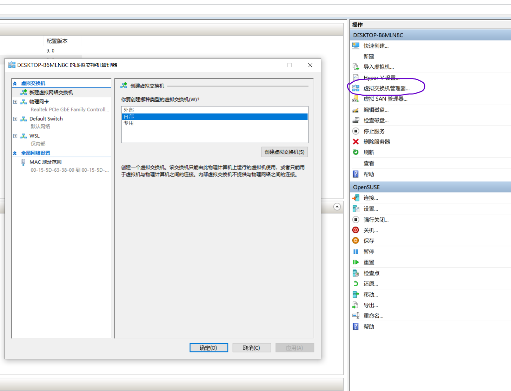
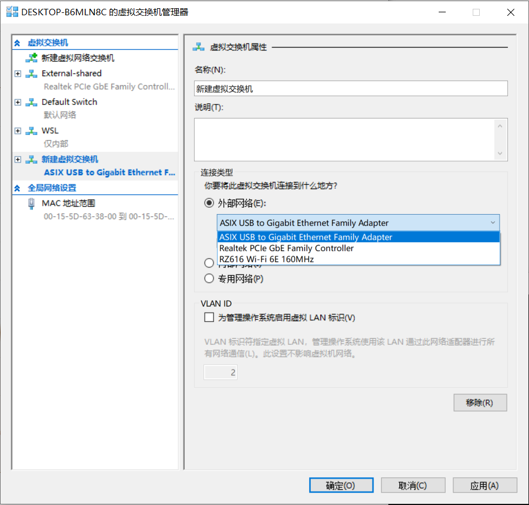

这个文章准备闹明白我电脑上的网路拓扑

我的一台 Windows 电脑，上面只有一个物理网卡，通过网线连接路由器。

然后我开启了 Hyper-V，创建了一个 Linux 虚拟机。

我又利用 Hyper-V 创建了 Docker。

电脑里还有 v2ray 代理软件，并且有可能打开 TUN 模式。

最后，我还有 Tailscale 的服务。

### 网卡

首先，一个电脑从理论上就是可以配置两个网卡的（你想想你笔记本肯定有 wifi 接口吧）

在最简单的情况下，系统会为每个网卡分配独立的 IP 地址，并提供路由表管理来决定不同目的的网络流量走哪张网卡

比如内网流量走内网网卡，外网流量走外网网卡

Win 通过 `route print` 命令能看的比较详细

### Hyper-V 的模式

Hyper-V 右边可以管理虚拟机交换器。分为外部、内部、专用三种，并且默认提供一个叫做 Default Switch 的交换机



专用网络：很少用。虚拟机完全无法上网。

内部网络：似于 NAT 模式。Default Switch，WSL 就是这个。（Default Switch，这个底下也标注了是自动采取 NAT）你也可以再新建新的。

外部网络：关键在于，它必须先选一个物理网卡

底下的“允许管理操作系统共享此网络适配器”的意思是：管理操作系统就是指你开启 Hyper-V 管理器的那个 OS，也就是 windows。共享是指，是 win 和 linux 一起用这个物理网卡，还是 linux 可以独占网卡。如果你有两个网卡，你可以不勾，然后 linux 走网卡，win 走 wifi。



### 外部网络拓扑

如果是最开始，那么你的网络拓扑是：

Windows -> 物理网卡 -> 路由器 -> Internet

现在则是，物理网卡充当交换器：

Windows -> 虚拟网卡 -> | -> 虚拟交换器（由物理网卡充当） -> 路由器 -> Internet
Linux -> 虚拟网卡 ->   |

我们可以很明显的发现，路由器通过 DHCP 服务，给 Linux 分配了 ip 地址

我们在 linux 上检查 mac 地址为 00:15:5d:63:38:07，发现它是一个假 mac

而在 Windows 上检查 mac 地址为 C4-C6-E6-34-C1-3F，依然是网卡的 mac

因此我怀疑：

（1）hyper-V 会让主机把原来网卡的 mac 抄过来，网卡此时透明了

（2）在任务管理器里，他会让虚拟网卡的名字，和虚拟交换器同名

（3）对于 Router 来说，是有一个新的虚拟的 mac 地址加入，因此给 Linux 发了 ip，但是它看不到交换器

### 软路由

TODO

### 旁路由

TODO

### 命令行代理

在非 TUN 模式，cmd 里无法 curl，即无法代理，但是 powershell 是可以的，它可以正常走代理，因为 cmd 的 curl 是 system32 下面的 curl.exe，而 powershell 是集成到 .NET 里面了

有一种临时的办法，不开启 TUN，则是设置临时环境变量

```cmd
set http_proxy=http://127.0.0.1:10808
set https_proxy=http://127.0.0.1:10808
```

```shell
export http_proxy=http://127.0.0.1:10808
export https_proxy=http://127.0.0.1:10808
```

一个程序能否走代理，不取决于它是从哪里启动的（CMD 或 PowerShell），而取决于该程序内部调用网络接口的方式

大体有三种：

（1）系统代理。会自动读取设置里配置的代理端口，比如浏览器，各种 GUI 程序。

（2）环境变量。一般是来源于 Linux 的程序，只认 http_proxy 和 https_proxy 环境变量，Windows 不自主定义这两个，所以我们需要重新定义它，骗过这些程序。比如 curl，git，npm。

（3）无法代理。写的比较粗暴，写死了。

所以，我们在 cmd 里配置临时环境变量，后续启动的进程都是子进程，自动继承环境变量，所以 git curl 可用。

我在配置 openclaw 的时候，发现它怎么也无法代理到 telegram，我就检查了一下，它是这样的

首先，shell 和 systemd 又两套独立的环境变量系统，git 是 shell 的子进程，但是像 openclaw 这种后台进程，是由用户态的 systemd 来唤起的

这导致你可能需要在 systemd 里设置变量，然而这样做以后，我却没有任何效果

我发现根本原因是 openclaw 用到是 nodejs 的 undici 库

```js
const { fetch } = require('undici'); // 或者注释掉这行，直接用 fetch，都一样
fetch('https://api.telegram.org').then(res => console.log('Success:', res.status)).catch(err => console.log('Failed:', err.message));
```

即便是能在命令行里能 curl，我们这行代码也无法执行

根本原因在于：环境变量 http_proxy 只是一个“约定”，而不是系统级的“强制规则”。所以，实际上还是需要 “TUN” 模式才行

有的 AI 建议我试一下大写的 HTTP_PROXY，但是其实没效果

### proxychains

这个工具是一个工具，而不是后台进程。它不虚拟网卡，而是运行时改一个库，然后让后续的程序实现代理

配置文件把默认的 socks4 删掉，然后换成 http 即可

这样 node 和 openclaw 都能代理成功