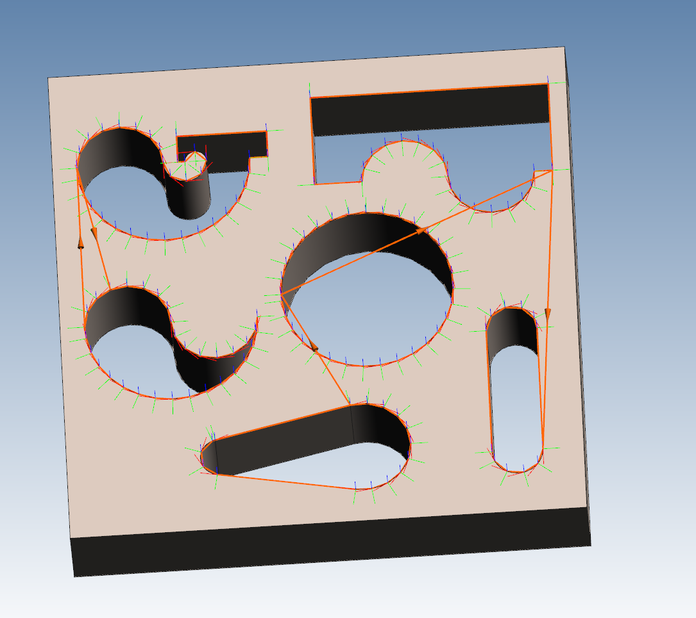
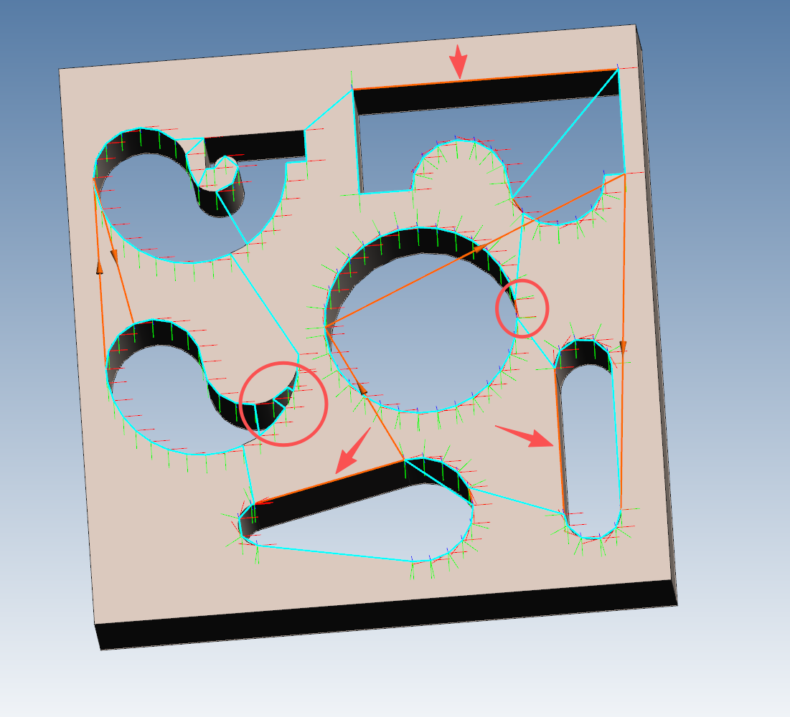
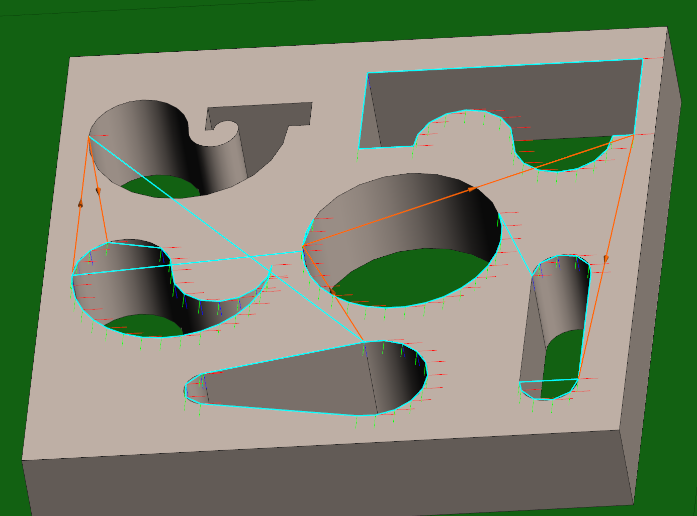
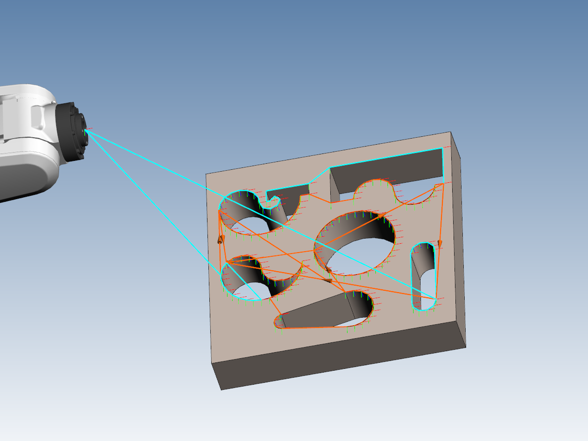
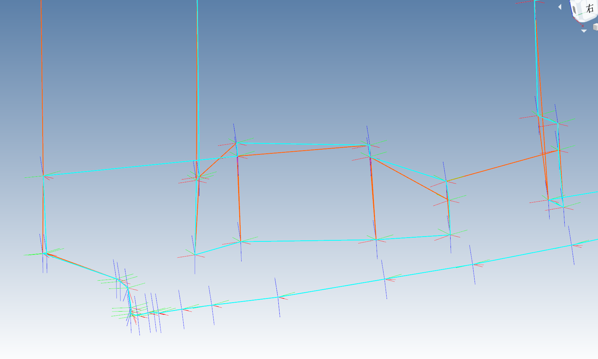

多旅行商问题

汽车路由规划问题 VRP 算是 MTSP 的一个进阶

这个问题可以用 google 的 or-tools 求解，它的文档很详细，我这种人都能跑通一个小例子

这里记录我在实际应用中遇到的问题

### 单旅行商



这个是我最开始要单机规划的，我发现什么参数都不设置，会有两个问题



1、无法形成局部闭环，有"缺口"

这是旅行商问题本身导致的，因为这种问题它一定是每一个点访问一次，所以只要所有点在同一级别的问题上，就必然会有缺口

解决方案：如果一个 Path 需要闭环，那就求它的质心，然后把整个 Path 当作一个城市来处理。

这样，最终结果可能不是最优了，但是为了闭环，这是不得不作的解决方案。

等待结果求出来以后，再拿出聚合点的上一个点和下一个点，看聚合点里，选哪个点作为入口和出口合适。

否则，对于我这个例子里的圆环，求解器很愿意让两个车分别抄它的左右路，而不是当作一个环

2、在尖点（锐角三角形处），容易左右跳跃

解决方案

（1）采取真实代价，这样需要求机器人工具转 180 度的代价，因此耗时陡增，会自动避免这个问题

（2）Path 内部给一个系数，即仅考虑位置时，我们把 Point 到下一个 Point 的代价设低

### 多旅行商

多旅行商时，如果我们给每个汽车的最大可执行时间设置的很高，那么求解器就会让一个车走完全程，另一个车不动

此问题（负载均衡）有以下解决方案：

（1）求解两次。第一次就让一个车走完，评估代价。然后对总耗时求均值，均值乘 1.3 作为一个上限，再求第二次。

（2）大概是这样设置一个全局总代价，但是这会导致求解时间极大的增长。必须多给时间，多求，这样结果才能好起来
```cpp
	RoutingDimension* mut_time_dimension = m_uptrRouting->GetMutableDimension("Time");
	mut_time_dimension->SetGlobalSpanCostCoefficient(100);  
```


图片：双机器人，但无聚合点


图片：双机器人，并且相邻 Point 设置 0.1，以避免跳跃

### 车子起点随意

它是这样，如果你 Point 为 N 个，而且如果你的起点就落在这里面，那你可以直接在 RoutingIndexManager 构造时，设置好 starts 和 ends

但是如果你想随意开始，你必须增加一个虚拟开始节点，它文档上写的是，通过把起点的邻接矩阵的行列都设置为 0。这实际上相当于随意开始随意结束，因为实际上相当于车子随时可以回到虚拟点，并且随时再出发，但是由于 TSP 的限制，不会随意回来，所以你如果结尾点也是虚拟点，那么就是随意出发随意结束

这就会导致你的邻接矩阵变成 N+1

但是这只是思想层矩阵变大了，实际邻接矩阵是给回调函数用的，你可以依然让矩阵为 N，然后在回调函数里，如果越界，你就给 0

但是实际情况往往是，机器人需要从过渡点开始干活，干完活回来

所以一个合理的思想是，把起点和点直接加入到所有点里面，这样，你也不需要思考谁合理了，你的矩阵变为 N+2，起点到各个点的距离还可以自定义，也可以一定程度避免左机器人去右边干活

我这里试了一下，并没有避免"左机器人去右边干活"，它是一个在外部干活，一个在内部，这样肯定会撞



### 并行计算

VRP 问题它是靠迭代来求的，依赖于前一步，所以这里必是单线程

要多线程只能宏观做

（1）多个 seed，从不同方向探索

（2）大问题拆小

### 轨迹规划



这个问题实际上和之前说的锐角三角形是同一个问题，如果你只管距离，那么就是会忽视掉焊点

甚至我认为，即使用机器人真实代价，也会忽视焊点，因为去焊点明显是更远的，平滑移动明显更省力

即无论是任何代价，我们都无法规划弓字形和之字形轨迹，因为这些轨迹要的就是“轨迹”，我们必须能找到“原始数据”，并且强制设置多个送货才能完成

所以轨迹按顺序给 0.1 的系数可能是必要的

在这个场景里，给系数就可以保证和原轨迹一致

疑惑：但是，如果真的给系数，那么我做 TSP 问题的意义何在？不还是依赖本身顺序吗？

### 问题分类

在二维平面内，如果每个点都有坐标，并且是算欧式距离。那么最优解的图，必定没有交叉，类似于构成一个多边形。

因为三角形两个边之和大于第三边。

并且 TSP 问题分为两种

经典的是，要求回到起点，构成闭环。此时，你的起点在哪里其实无所谓，你可以直接给 0，反正你是闭环。

如果只要求遍历所有城市，不要求闭环，那么就是一条线。此时考虑增加虚拟的仓库来算。

### 经典算法

最小生成树 MST（Prim、Kruskal）：就是在一个图里，找到连接所有城市，如何最少花费来修路。只能说这个名字确实怪

迪杰斯特拉

A-Star

2-opt：如果路线中有两段边交叉了，那么解开这个交叉几乎总能得到一条更短的路线