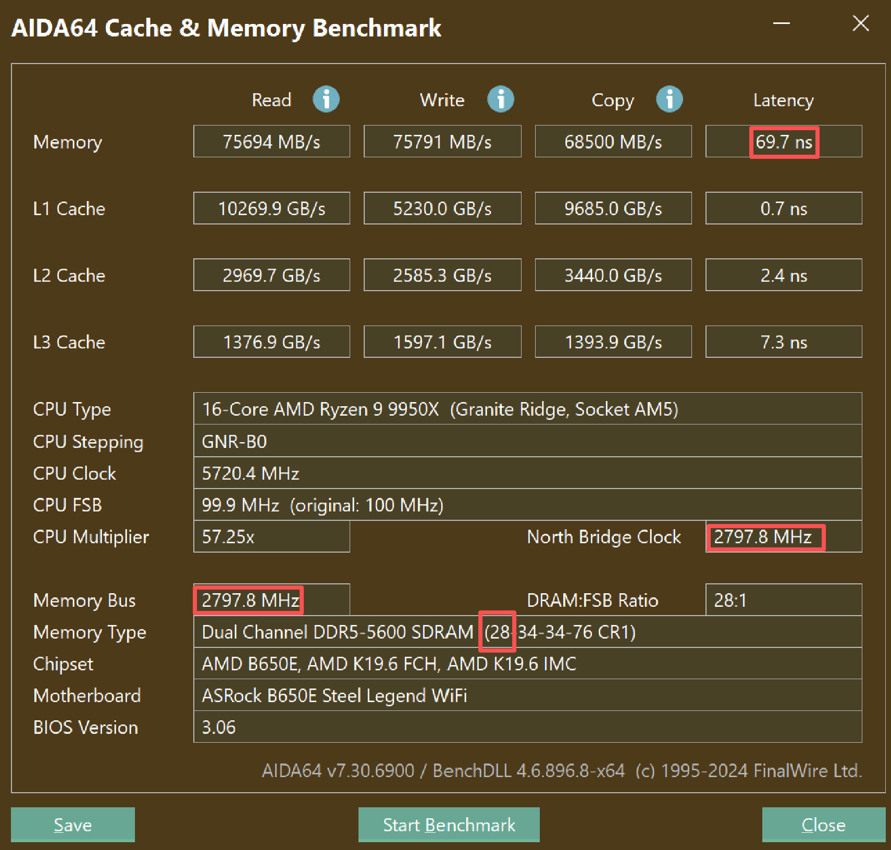

#### 单位

1bit = 1Byte

1K = 1000

1M = 1000000

1G = 1000000000 = $10^{9}$

1ms = 0.001s

1ns = 0.000001ms = $10^{-9}$

#### 主频

目前主流的家用 CPU 的频率是 `5.0 GHz`

也就是 `0.2 ns` 就可以有一个周期

而 GPU 的频率则低一些，比如 RTX 4090 非公版，一般会在 2.6 GHz 附近，GTX 1660Ti 在 1.7 GHz 附近

#### 内存

现代 DDR 内存 

内存控制器 IMC：这个是集成在 CPU 内部的

1、频率。

我们口头说频率，都是指等效频率。

在 DDR5 平台，等效频率一般为 6000 MHz 附近，在 DDR4 平台，则是 3000 MHz 附近（很多老的机型可能只有 2133 2666）。如果你手动超频，最多会高 25%，如果什么都不调整，内存本身也比较烂，会低 25%。手机的话，目前很多都能飙到 8000，好像甚至上万。

而软件里一般显示的是工作频率。DDR 的意思是 Double Data Rate 双倍速率，通过每个时钟周期传输两次数据使内存带宽翻倍。所以很多时候显示出来的频率翻个倍，才是等效频率（不管是 D4 还是 D5）

工作频率 和 北桥频率 North Bridge Clock 应该是一致的

比如我这台电脑，Input Clock Frequency  2800 MHz (0.357143 ns)

2、时序。

这个就是指通信延迟。

这里有很多参数，一般说的是第一主要时序，一个叫做 `CAS# Latency` 的参数，缩写也就是 CL。

这个数值，在 DDR5 平台表现优异的一般是 30，在 DDR4 平台可能在 18。从 D4 到 D5，频率翻倍，时序也翻倍。

这个数值的单位是"时钟"或者说"周期"。

超频时，时序和频率，如鱼和熊掌，不可兼得。

3、通道。

DDR4 一般你插一个内存条，就是一个通道。但是插满四个，并不一定是四通道。

理论上，1 通道 4266 = 2 通道 2133，这也是为什么推荐买两条内存。

4、延迟计算

延迟 = CL / 工作频率，比如我这里一个 CL = 30 工作频率是 3000 MHz，那么我的延迟应该是 10 ns

50ns 在我这个 5GHz 的 CPU 上，应该是 250 个周期

5、其他。

（基于 DDR5 平台）

FCLK：**Fabric Clock** 这个也是集成在 CPU 内部的，是一个 AMD 的专用，可以调整。它用于同步内存、缓存、核心。据说一般建议是内存频率是 FCLK 的整数倍，并且越高越好，FCLK 的数值一般是 2000 MHz 左右。

MCLK：内存工作频率，数值是 3000 左右

UCLK：内存控制器频率，数值也是 3000 左右

6、检查。

在 AIDA64，Benchmark 里检查你内存具体参数

如图，我这里没有进行任何超频，内存延迟为 70ns，与理论想去甚远（即使像发烧友一样超到极限，我看不会低于 50）笔记本的延迟要比台式机大

类型里显示了你在 BIOS 里配置的所有时序，第一主时序 CL，我这里是 28

#### 显存

可以在 techpowerup 这里查询到每个显卡的内存频率

https://www.techpowerup.com/gpu-specs/geforce-rtx-4090.c3889 

https://www.techpowerup.com/gpu-specs/geforce-rtx-4080-super.c4182

以 RTX 4090 为例，其内存频率是 Memory Clock 的数值，即 1313 MHz 或 等效 21 Gbps

然而 RTX 4080 Super，其内存频率却显示为 1438 MHz 或 等效 23 Gbps

而采用 GDDR7X 的 RTX 50 系显卡，其内存时钟频率是 1750 MHz 或等效 28 Gbps

我这里观察了一下，4060 的频率是 2125 MHz 等效 17 Gbps

以 4090 来看，它的内存带宽显示为 1.01 TB/s

GPU 的显存带宽：

公式：`带宽 = 频率 * 位宽 / 8`

这里，`21 * 384 / 8 = 1.008`，必须按照等效频率来推

而 1313 MHz = 1.313 GHz 实际周期为 0.7ns

然而实际上 GDDR6X 延迟 大概在 180ns 级别

现在主流 CPU 都会把内存控制器和主频分开

DDR4 -> DDR5

GDDR4 -> GDR5X -> GDDR6 

都使用了一些技术，使得等效带宽翻倍，同时延迟也翻倍

不像自己超频，频率越高，CL 不变，则延迟越低。显存的 CL 远高于内存