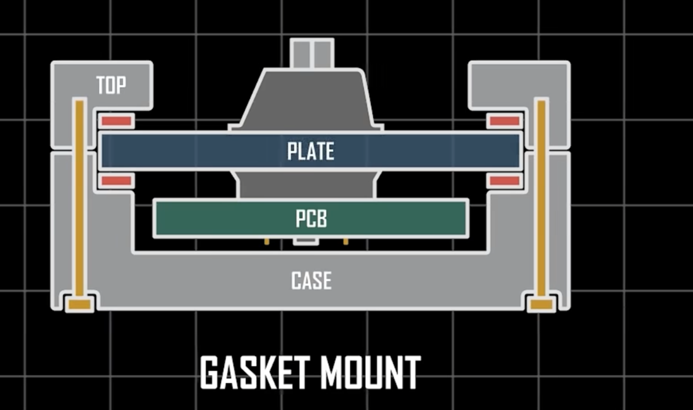

### 结构名词解释

gasket：直译是垫片

定位板：用来卡住轴体位置的一个结构

之所以需要定位板是因为轴体的三脚直接和 PCB 接触，不稳定

以前电路板和定位板之间是直接拿螺丝强行固定

现在，固定在上壳叫做 top，下壳叫做 bottom，直接夹中间叫做三明治

三明治别直接夹，放几个垫片垫住，就是 gasket 了

不是什么先进的不得了的技术

无钢：

直接把 PCB 固定到壳体上，没有定位板，造价便宜，灵活度高，容易坏

很多情况下要直接把轴体焊死在 PCB 上，无法热插拔

之所以叫钢，是因为最开始的时候定位板都是钢的。现在一般选用更软弹的材质，并且是需要开槽增加软弹度的

Gasket 核心：

减小定位板和外壳间接触导致的外壳震动

铝壳：

之所以外壳搞得越来越重，是因为键盘如同音响

高密度材料回音效果好，音响里，木质材料都有细分

只有上盖是铝，本质还是一个塑料键盘，因为关键点是底下是否是铝

声音表现：

1、轴体：轴体撞击是声音最初的来源

2、键帽：键帽有一个空腔，可以产生回音，矮键帽更静音，高键帽反之

3、空腔填充：消除空腔音

### 材料

POM：聚甲醛，自润滑性

PP：聚丙烯，轻质树脂

FR-4：这个是耐燃材料等级的代号，内部实现有很多种，比如环氧树脂、玻璃纤维。在键盘这个领域，可以认为就是玻璃纤维，和 PCB 这种电路板的基材是一样的

玻璃纤维：Fiberglass，这个东西并不是天然的，一般就是先熔炼玻璃，然后拉丝，不过玻璃纤维属于 2B 或 3 类致癌物

石棉：这个是天然的，可挖掘后直接使用。是一个镁硅化合物

### 组装名词解释

box：

box 轴体是凯华推出的一种轴体

本意是指内部结构不像 MX 轴体那样，是直接挤压弹片，而是把弹片封装到一个小盒子里，利用塑料去挤压

但是其大多数情况下不是十字轴心，而是防尘壁轴心，这会削弱听感

大键调教：

如果你不准备仔细调教（极限追求），可能不换大键是一个好的选择

因为空格键如果一旦拆下，它经常需要左摇右晃的拆下来，部分大键本身塑料，以及卫星轴钢丝会发生形变（虽然我们换轴体也必须拆下大键）

卫星轴分类：

P 卫 即 PCB 卫星轴，PCB 上开一个孔，然后让卫星轴卡在这个孔里，精度可能会更好一些，但是拆装麻烦，因为你必须把定位板拿开才能安装。

按照这个圈子内部的意思，P 卫有点属于追求极限的意思，但是按照我个人理解，之所以 gasket 结构出现，不就是因为轴直接安装在 PCB 上导致晃动，才出现定位板吗？怎么这里又回去了

钢卫 即 钢板卫星轴，方便拆装和调教。钢板卫星轴像轴体一样，卡在定位板上。大多数键盘是这样子，并且如果你打算买定位板，你需要搞清楚买的是哪种（有两者都兼容的）

卫星轴结构：
现在大部分键盘都是卫星轴（另一种实现叫做平衡杆，由龙船龙豆组成），卫星轴也是有一个钢丝的，不然你怎么把左侧的力传导到右边呢，你左右如果是独立的那么没办法保证按左边就全沉下去

这个所谓的钢丝音就是来源一卫星轴里的这个钢丝，钢丝不平

### 大键调教

1、空格掰直。热水或者热吹风，加热，按照空格正装时，远离你的那一侧，然后让两端靠近你，中间远离你

夸张一点就是空格形成一个圆弧，包裹你，这个姿势调整

然后就是空格填充胶条、海绵（我填充硅胶解决空腔音）

据说最有效的办法是，找一个平直的钢板，然后把空格绑在钢板上，绑死，然后用热水煮一下，立刻解决问题（PBT 热升华适用）

2、卫星轴

钢板卫星轴 首先检查是否晃动，如果晃动，说明定位板不精准，需要用特氟龙胶带卡紧

其次是钢丝是否平直，如果不平就换一套或者掰直

然后就是润滑轴体，润滑据说最好不是护手霜，后期会干涸，但是我就用护手霜，因为我买的“氪制化”润滑油，过一年就坏掉了

3、安装

一指禅：治标不治本，打字用力照样会跑偏。但是算是一种有效途径，治标治的还算比较长久
