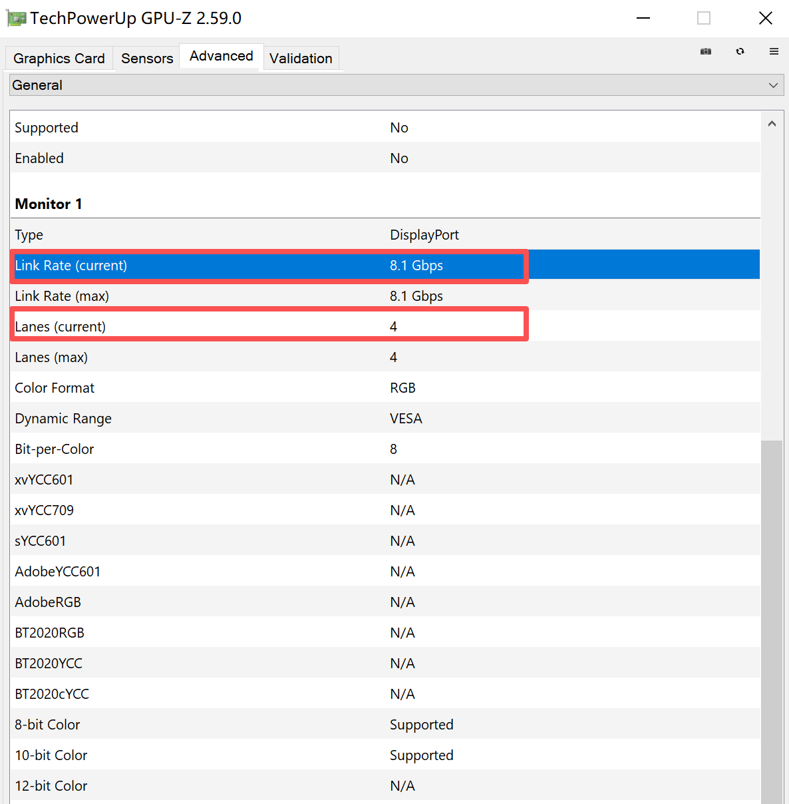

对于 HDMI 以及 DP 的标准有所了解，但是不是很透彻

以及各种 HDR 标准

这篇文章准备彻底搞清楚

## 显示协议

### DP

DP 主要有 DP 1.2 1.4 2.0

目前主流是 1.4 支持带宽 32.40 Gbps 4K120Hz

各个版本的带宽可以在维基百科上找到，这里不再截图列出

简要为：

1.2 支持 21Gbps，1.4 支持 32Gbps，并支持 DSC 技术，2.0 支持 80Gbps

### HDMI

目前主流是 HDMI2.1，支持带宽 48 Gbps 4K120Hz

现在，HDMI2.1 的标准比较的混乱，分为：

TMDS2.0 与 FRL2.1

(1) HDMI 官方认为，HDMI2.0 已不复存在，任何设备不应该再标注兼容 HDMI2.0，HDMI2.0 改称为 HDMI2.1TMDS

(2) HDMI2.1 的所有新功能都是可选项，不强制要求支持，包括更高带宽

直白的说，就是以前的 HDMI2.0 也可以叫 HDMI2.1 了，但是其实是 TMDS。真正的 HDMI2.1 是 FRL。

### DSC

主流的 DP 和 HDMI 支持的分辨率都是 4K120Hz，但是实际上有很多显示器厂家开始生产 4K144Hz，甚至更高规格的显示器，这样带宽上是否无法支持？

答案是依然可以支持，通过 DSC 技术

DSC 压缩技术是一种有损压缩，但“用户无法分辨压缩图像和未压缩图像之间的区别”

DSC 1.2 版于 2016 年 1 月 27 日发布，包含在 DisplayPort 标准 1.4 版中

根据此技术，采用 HBR3 的 DP1.4，可以支持 4K240Hz

HBR3 是 DP 协议中定义的一种传输模式，即 high bit rate 高比特率第三代

### UHD FHD

UHD 以及 Full HD 是什么东西？

简单理解就是：

Full HD 直译“全高清”，实际上可以认为就是 1920*1080

UHD 是 Ultra HD 直译“超高清”，没有具体限制。4K UHD，8K UHD 都有

### 如何查看 DP 工作在什么状态

这个似乎没有一键通过命令行解决的办法

根据 GPU-Z 提供的信息，可以推算出总带宽

如果你是 DP：

标准 DisplayPort 连接有 4 个通道，标准 4 通道连接中主链路的

总带宽是所有通道的总和

4 × 8.10  Gbit/s = 32.40  Gbit/s

进而推算出是 DP1.4 还是 DP1.2

### 如何查看 HDMI 工作在什么状态

没有什么简单的方法，基本是要读取 EDID 的（一个存储在显示器中的数据，用于确定协议）

### 线缆哪种好？

HDMI 的线缆和网线类似，纯线缆传输数据，不包含芯片

DP 同理，都是无芯片的纯线缆

所以线缆好，实际上就是铜线更粗、屏蔽层更厚

粗等于好，对于这个线缆基本适用（不包括光纤）

所以 HDMI2.0 时代发布的线缆，体质好的，2.1 时代可以当 2.1 用，因此有些商家所谓 2.1 其实和 2.0 没什么区别

### 正确的插拔 DP 线缆

DP 接口处有两个钩子，提供更牢固的链接

按动接口上的凸起可以让钩子收起来，方便取下（按下的位移很短，实际上是稍稍向内能推动一点距离）

如果不按的话需要用蛮力或反复拉扯，可能损坏接口

### 参考资料

https://www.bilibili.com/video/BV1ES4y1Q7Ck

https://en.wikipedia.org/wiki/HDMI

https://en.wikipedia.org/wiki/DisplayPort

http://en.wikipedia.org/wiki/Display_Stream_Compression

## 显示器面板

### LCD

LCD 可发光二极管，即传统面板，特点是背后有一个背光板，前面覆盖液晶颗粒

每个像素，上面有三个红绿蓝屏蔽层，通过给液晶分子施加电压，使得液晶分子旋转，进而遮挡背光板发出的光，让屏幕呈现各种颜色

### VA IPS TN

根据液晶分子磁场设计，旋转方式，LCD 显示屏可以分为三种类型

响应速度：TN > IPS > VA

可视范围：IPS > VA > TN

色彩：VA > IPS > TN

响应速度影响拖影，拖影是否明显，你可以打开白纸黑字的窗口平移，观察文字清晰度

因此，IPS 一般作为显示器使用，VA 一般做电视屏幕，TN 基本只做专用电竞显示器。一些早期古董或劣质显示器，由于成本问题，也会选用 VA

区分：TN 只有卓威这种电竞厂商才出品，都是那种 500fps 的显示器，无需区分。IPS 的屏幕用指关节按压，区域无明显变化，即硬屏；VA 则有明显变化，手离开后，过几秒才会恢复，即软屏

缺陷：

（1）由于液晶分子旋转后，遮挡的面积有限，无法达成"纯黑"，每个像素，总是有光从背光板射出，即使很小，使得对比度低（这也是 VA 面板的相比于 IPS 的优势）

（2）一块背光板，需要在四边进行封装，如果封装技术不到位，则会"漏光"，使得屏幕黑的不均匀。可以关灯后，显示黑色图片观察漏光情况。目前，好的封装只能缓解漏光，没有厂商能完全不漏

### OLED

OLED 有机可发光二极管 新式面板，特点是每个"像素"由一个可发光二极管组成，独立发光 广泛用于手机等可移动设备

OLED 目前（2025-3）只做高端显示器和高端电视，国内厂商（京东方，天马，华星光电）基本只做手机屏幕，电视和显示器被 LG 和 SAMSUNG 近乎垄断

优势：

（1）由于不需要每个位置都发光，黑色部分可节能。因此耗电量低，同时对比度增高

（2）无需液晶分子反转，相应快，无拖影

缺陷：

（1）调光方式。LCD 为背板均匀发光，而 OLED 分子无法控制亮度，只通过占空比的方式"降低"亮度（即以 10 亮度工作 1 毫秒休息 1 毫秒，达到伪 5 亮度）
这是 OLED 最被诟病的一点，目前所有手机都是这样，不过手机厂商通过"高频 PWM""类 DC"的方法缓解此问题，在高端显示器或电视上，基本为"类 DC"调光，"类 DC"即直流调光，但是由于有机物本身需要刷新，因此依然有细微频闪

（2）寿命问题。由于是有机物，长时间发光后变性，尤其以高能亮的蓝色像素为最。长期显示相同内容，会导致"烧屏"问题，厂家会采取抖动等技术缓解

（3）PPI 缩减、字体边缘异色。传统 LCD 一个像素为 R+G+B 的正方形，三均分。而 OLED 分子由于寿命等原因，一般两个蓝色对应一个红绿，并按照"钻石排列"等方式排列，因此，同分辨率同屏幕大小，PPI 不如 LCD（如果是钻石排列那种排列的话）。并且字体边缘（如一条横线）无法准确的分割两个像素，需要算法来借用不同的像素，导致彩边（此问题在 2K27 寸 OLED 上尤为明显）

（4）总体最大亮度不够高，借助于有机物发光，无法媲美背光板的高亮度

### MiniLED

为解决传统 LCD 面板背光问题，厂商们想到，把背光拆分为几千个区域，分别控制亮度，以达到"伪"OLED 的效果

目前国内海信、TCL 等公司主推 MiniLED，而韩国公司主推 OLED

MiniLED 也是分三种，但是其实没人用 TN，因此它可以搭配 VA、IPS

缺陷：

即便是分成几千个区域，依然不够小，纯黑背景显示一条高亮白色细线，会有"佛光"

功耗非常高（我那款，以及那几年出的 MiniLED 的 iPad 续航都绷的很彻底）

个人点评：

我认为 MiniLED 的真正技术在于控光算法，是否能合理、及时调整背光区域是关键。在线下体验多品牌的电视后，我认为好的算法可以媲美 OLED，然而坏的算法一眼看出佛光，属于是一个上下限差距较大的技术

### MicroLED

下一代显示技术，概念已提出多年，但是目前没有民用产品

每个像素是一个 LED 的面板，独立控制，但是比 OLED 好在不是有机物，而是极小的 LED 管

### 厂家专有名词

WOLED：

用发出白色光的 OLED 像素，上面覆盖 RGB+W（白色）四种膜来区分颜色

直出白色可以解决亮度低的问题，蓝色膜可以解决蓝色像素衰减问题。然而，红绿的色彩不够纯净，色域低，高亮度下尤为明显

QD-OLED：

所谓量子点 OLED，是用发出蓝色光的 OLED 像素，上面覆盖能激发出红或绿光的量子点薄膜，三者混合出光

优势是色域更高。但是像素按照"品字"排列，又有彩边和 PPI 缩减的问题，而且它一定会做成镜面屏 + 抗反射图层，导致和在明亮的室内，暗部发紫，并不能达到理论上无限的对比度

HVA：

华星光电出品的 MiniLED + VA 面板，据说还有什么多液晶合一技术，即一个像素里放好几个液晶分子，可控性更高

RGB-MiniLED：

国内厂商为了解决色域问题，就是把 MiniLED 的背光灯珠，从一颗白的，换成 RGB 三色

SQD-MiniLED：

S 是 Super，和 QD-QLED 一样，也是蓝色 OLED 灯珠，但是激发一个“超级”量子点膜，以便于形成白光。对比 QD-OLED，色域更广

双层 OLED：

目前似乎就直接叫做双层 OLED，此技术最早出现于 iPad Pro M4，后续一些笔记本（联想），手机（包括华为）也开始用

既然一层 OLED 有问题，我们直接上两层，一起发光，更高亮度，由于每层不需要那么高亮度，还能省功耗，通过算法，我们还可以缓解寿命问题

缺点，OLED 本身 PWM 调光，以及价格昂贵（目前没有民用级显示器和电视），以及似乎会有"mura 抹布屏"问题（低亮度色彩不均匀）

### ltps ltpo

这是 OLED 每个像素开关的材料

S 表示硅，O 表示有机物

LTPS 刷新率几个挡位不可变，几年前的 OLED 手机比较常见

LTPO 现在手机一般都用这个，即所谓可变刷新率技术，实现 1-120Hz 调节，你滑动，它就调高，你不动，就调低。息屏显示依赖于这个功能

## HDR

### DisplayHDR 硬件标准

High dynamic range

高动态范围

动态范围的含义：最亮和最暗的范围，即比值

https://displayhdr.org/

LCD 和 OLED 的 HDR 是分开计算的，因为 OLED 本身其实是无限对比度，所以在 LCD 上，我们比较这个比值（LCD 亮度基本都能达标），在 OLED 上，我们看最大激发亮度

你的显示器上很可能贴有 VESA DisplayHDR 的贴纸，但是请注意，DisplayHDR 只是一个硬件标准

- LCD：DisplayHDR 400、DisplayHDR 500、DisplayHDR 600、DisplayHDR 1000 和 DisplayHDR 1400

- OLED：DisplayHDR True Black 400、DisplayHDR True Black 500 和 DisplayHDR True Black 600

现在（2025-3）b 站是网页端支持 HDR，客户端似乎不支持

油管网页也支持

如果你开启 HDR，在此网站你可以看出区别：https://webkit.org/blog-files/color-gamut/comparison.html

### HDR 视频格式

与 DisplayHDR 对应，视频必须以 HDR 格式封装，才能显示出来，缺一不可，即视频里也要有 HDR 的信息，这是一套软硬结合的体系，因此这里其实进入音视频处理领域了，不只是采购显示器了

SDR 视频一般亮度范围为：16-235（TV Range），0-255（Full Range），这个在 N 卡控制面板里可以控制，这是一个相对值，255 为你当前显示器最大亮度

而 HDR 视频亮度一般为绝对亮度（即多少 nit）

### HDR10 HDR10+ HDRVivid 杜比视界

HRD10 这是 HDR 最基本的标准，基本都支持。HDR10 是一个静态 HDR 标准，这意味着它使用固定的亮度和对比度设置，适用于整个视频或内容

HDR10+：三星等公司为了抗衡杜比授权费搞得

HDRVivid：我们国家自研 HDR，避免授权费

个人备注：感觉杜比视界到底能不能实现 HDR 不好说，感觉主要是看认证，苹果的设备都支持这个，或许 Douby-HDR 是杜比视界的一部分？

### HDR 的问题

按照影视飓风不再创作 HDR 视频的说法，他们发现 HDR 的受众比较少，而且如果做 HDR，那么传到 b 站，b 站会自动给你转一份 SDR，这一份 SDR 不合理，不能表达他们的意图，确保 SDR 是准确的

因此，自媒体用户创作 HDR 较为费劲，只有掌握整个链路的电影电视剧，做 HDR 效果才好

### 确认视频是否为 HDR

`ffprobe -i "your.mkv"`

其中必须输出 `yuv420p10le(tv, bt2020nc/bt2020/smpte2084)` 

如果是 ` yuv420p(tv, bt709, progressive)` 则说明是 SDR

因为网上很多标明为 HDR 的视频其实

### SDR 模式观看 HDR 视频

如果你的电脑没有开启 HDR，那么你用 chrome、mpv 等播放器播放 真 HDR 视频，那么颜色并不会发生混乱，因为这些播放器给你自动做了颜色转换。一般这种情况下不会出现问题

### HDR 模式观看 SDR 视频，或使用非 SDR 应用（如桌面）

在 Win10 上，HDR 设置里有一个滑块。可以控制将白色映射到多亮的亮度，你可以调低让它没那么亮。

一般这个滑块处于中间位置时，我个人认为桌面会比较亮

大多数 SDR 视频是基于 100 nits 标准制作的。当开启 HDR 模式时，系统会对 SDR 视频进行映射，试图让它在 HDR 容器中看起来“正常”

但由于 UI（白色窗口）被滑块推到了极高亮度，相比之下，遵循标准亮度的 SDR 视频就会显得非常“阴暗”或“无力”

在这种情况下，你用 chrome 或者 npv 观看 SDR 视频，其实显示的内容是对的，因为它就那么暗，就是 100nit

但是，chrome 似乎还有先进机制，说是能平衡全局亮度。就是你在 chrome 上看 b 站 YouTube 的 SDR 视频（右键显示为 bt709），它亮度和旁边白色 UI 也是一致的

其实网上都建议换 Win11，不过我手头没 Win11 机器，Win10 的不合理

### obs 录制 HDR 视频（桌面）

TODO

### 白色区域亮度发生改变

当你播放一个黑色的视频时，旁边白色的 UI 变暗（相比于全白 UI）？

按照 HDR 的理想标准，白色部分的亮度应该保持不变（即“绝对亮度”原则）

然而实际情况是：

OLED 有 ABL 机制，全局总功率一定，只有小区域白能非常亮（这解释不了这个问题）

MiniLED 有控光，但是不是像素级，在黑白交接的分区，它需要 50% 的光，但是如果它这样直接一刀切，可能会导致你黑视频一圈的白色暗，更远的白色亮

所以算法会让它渐变，远的白色也一起暗